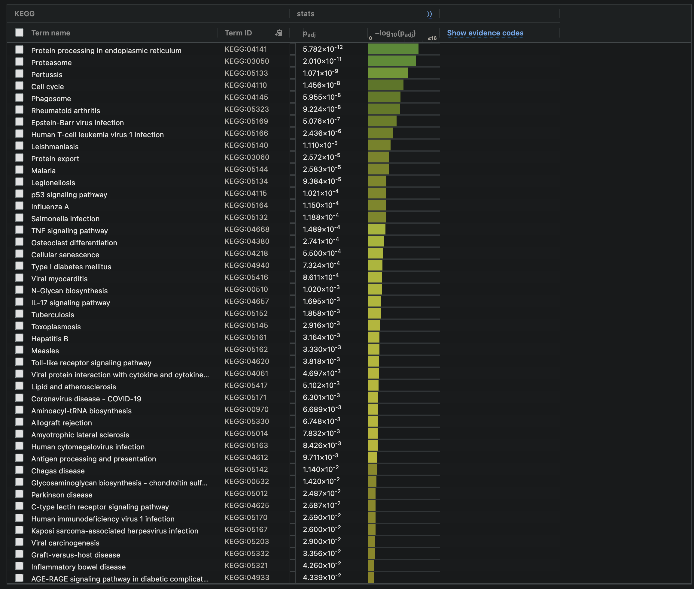

```{r, message=FALSE, warning=FALSE, error=FALSE, results='hide'}
if (!requireNamespace("ggrepel", quietly = TRUE)) {
  install.packages("ggrepel")
}
library(circlize)
library(ComplexHeatmap)
library(dplyr)
library(edgeR)
library(ggplot2)
library(ggrepel)
library(gprofiler2)
library(knitr)
library(kableExtra)

setwd("/home/rstudio/projects")
```

# Introduction

The dataset I will use in this report is the same one I prepared in Assignment 1, originating from the Diet-omics Study of Urban and Rural Crohn Disease Evolution (SOURCE) cohort, with GEO accession ID GSE233900. In the original study, the investigators examined how environmental, dietary, and microbial factors may interact with the human host transcriptome, particularly in the pathogenesis of Crohn’s disease (CD). Their analysis covered 380 participants across rural and urban regions of China and Israel, capturing both dietary habits and clinical parameters [@braun_2024; @coward_2024]. From this broader cohort, 40 ileal tissue biopsy samples (20 from patients with Crohn’s disease and 20 from non-CD controls) were profiled by RNA-seq, resulting in a dataset that includes both annotated clinical metadata and raw count data.

In Assignment 1, I downloaded the raw RNA-seq counts, filtered out genes with extremely low expression (fewer than 1 CPM in at least 4 samples), mapped remaining genes to HUGO symbols using biomaRt, and normalized the counts via the Trimmed Mean of M-values (TMM) method from edgeR [@isserlin_2025a; @yunshunchen_2017]. I subsequently removed transcripts that lacked a valid HGNC symbol or were duplicates of the same gene, ending with a final dataset of 16,408 genes across the 40 samples. This final processed dataset—along with the truncated sample annotations focusing on disease status (CD vs. non-CD), patient group, age, and sex—was saved in two files:

A1_normalized_counts.RData: contains a data frame named final_normalized_counts (16,408 rows x 40 columns), where each row corresponds to a unique HGNC symbol and each column corresponds to a sample’s TMM-normalized expression values.

A1_truncated_sample_annotations.RData: contains a data frame named sample_metadata (40 rows x 4 columns), storing attributes such as diagnosis (CD or Control), patient_group (Rural, Urban, or CD), sex (male/female), and age.

Below is a code snippet demonstrating how I load these final data objects and display a quick summary. This code will serve as the foundation for further steps in Assignment 2.

```{r}
# (40 x 4 data frame named sample_metadata in A1)
load("A1_truncated_sample_annotations.RData")

# (16,408 x 40 data frame named final_normalized_counts in A1)
load("A1_normalized_counts.RData")

cat("Dimensions of sample_metadata:", dim(sample_metadata), "\n")
head(sample_metadata)

cat("\nDimensions of final_normalized_counts:", dim(final_normalized_counts), "\n")
head(final_normalized_counts[, 1:5])  

kable(sample_metadata, caption = "Table 1: Truncated sample annotations for GSE233900")

```
As seen above, there are 40 samples (rows) in sample_metadata, each annotated with the information needed for grouping (CD vs. Control). The final_normalized_counts data frame has 16,408 rows (each row a unique HGNC symbol) and 40 columns (each column corresponding to a sample). TMM normalization [@yunshunchen_2017] was applied in Assignment 1, which corrects for compositional differences across libraries.

Note: GSM7438854 to GSM7438873 are control samples while GSM7438874 to GSM7438893 are CD samples.

The code below modified from lecture [@isserlin_2025a].
```{r}
# --------------------------
# Pre-Multiple Hypothesis Testing Step
# --------------------------

# Visualizing how CD samples cluster relative to non-CD controls
# in the TMM-normalized data
limma::plotMDS(final_normalized_counts, 
               labels = NULL,
               main   = "MDS Plot: Crohn's vs. Non-Crohn's",
               pch    = 19, 
               cex    = 1.3,
               col    = c("orange","purple")[factor(sample_metadata$diagnosis)]
)

legend("topright", 
       legend = levels(factor(sample_metadata$diagnosis)), 
       pch    = 19,
       col    = c("orange","purple"), 
       bty    = "n",
       cex    = 0.8
)
```
The MDS plot shows a clear separation between the Crohn’s disease (CD) and control samples, with CD samples clustering predominantly on the right and control samples on the left. This separation suggests that the gene expression profiles of these two groups are distinct, with the first principal component (Leading logFC dim 1) explaining 71% of the variance. The second dimension (Leading logFC dim 2) captures an additional 10% of the variance, indicating that most of the variation in the dataset is due to differences between CD and non-CD samples.

While there is some overlap between the two groups, the clustering pattern indicates that disease status has a strong influence on transcriptomic variation. 

```{r}
# Making sure Control is the baseline level
sample_metadata$diagnosis <- factor(sample_metadata$diagnosis, 
                                    levels = c("Control", "CD"))
design_matrix <- model.matrix(~ sample_metadata$diagnosis)
design_matrix
```
The control samples take on the factor level 0 (as shown in column sample_metadata$diagnosisControl), while the CD samples take on the reference level (1). Thus, the fold changes produced in the differential expression analysis will represent the change from control expression levels to CD expression levels. 

As noted in class, the best differential expression test for our use case is likely `glmQLFit` as it provides more accurate type I error rate control and robustness to outliers for RNA-seq data than alternatives [@isserlin_2025a].

```{r}
# FITTING A QUASI-LIKELIHOOD NEGATIVE BINOMIAL GLM WITH EDGER
# Construct a DGEList using the TMM-normalized counts and diagnosis groups
dge_object <- DGEList(counts = as.matrix(final_normalized_counts),
                      group  = sample_metadata$diagnosis)

# Estimate dispersion parameters for the NB model
dge_object <- estimateDisp(dge_object, design_matrix)

# Fit a quasi-likelihood model
fit_qlm <- glmQLFit(dge_object, design_matrix)

# QL F-test comparing Crohn's Disease vs. Control

qlf_results <- glmQLFTest(fit_qlm, coef = "sample_metadata$diagnosisCD")

# Obtain all genes sorted by ascending p-value
qlf_sorted <- topTags(qlf_results, 
                      sort.by = "PValue", 
                      n       = nrow(final_normalized_counts))

# STORE THE RESULTS TABLE FOR DOWNSTREAM ANALYSIS
my_DE_results <- qlf_sorted$table
head(my_DE_results)
```
Here, a positive log-fold change (logFC) indicates upregulation in CD samples relative to controls, whereas a negative logFC suggests downregulation in CD samples.

```{r}
# Count how many genes have raw p-value < 0.05
sum(my_DE_results$PValue < 0.05)
```
Out of the 16,408 genes analyzed, 8,151 (~49.7%) exhibit nominal significance (p-value < 0.05), suggesting  transcriptomic differences between Crohn’s disease (CD) and control samples. While the samples did cluster somewhat well in the MDS plot, this number is unusually high. If most genes remain significant after correction, the result it suggests systemic dysregulation; however, if many genes lose significance after correction, this could indicate the need to consider confounding factors.

To apply a more stringent threshold, a threshold of 0.5 log fold change can be considered for more sensitive changes to analyze while a threshold of 1 can be used for higher confidence results [@love_2014]. Considering the high proportion of genes left, lets examine the threshold at 1.
```{r}
# log fold change > 1
sum(abs(my_DE_results$logFC) > 1)
sum(abs(my_DE_results$logFC) > 1 & (my_DE_results$PValue < 0.05))

# log fold change > 0.5
sum(abs(my_DE_results$logFC) > 0.5)
sum(abs(my_DE_results$logFC) > 0.5 & (my_DE_results$PValue < 0.05))


```
With the more stringent threshold of |logFC| > 1, only 766 genes (~4.7% of 16,408) show a substantial expression change between Crohn’s disease (CD) and control samples. Among these, 764 genes (~4.7%) also pass the statistical significance threshold (p-value < 0.05). 766 genes meet the absolute log fold change threshold (|logFC| > 1) while 764 genes meet both the logFC and statistical significance (p-value < 0.05) thresholds. Testing at the threshold of |logFC| > 0.5, a similar proportion pass both thresholds 2961/3065 genes (~0.97). This high proportion of genes meeting the log fold change and p-value thresholds suggests that most genes with large expression differences are also statistically significant [@love_2014].


# Multiple Hypothesis Testing
From the original result, we have 8151 differentially expressed genes. However, given a p-value of 0.05, we expect a false-positive result of 5% by chance. To correct for false positives, 

We will be using the Benjamini-Hochberg correction to correct for false positives as it effectively controls the false discovery rate (FDR) when testing a large number of genes [@isserlin_2025a]. The cut off we will be using is 0.05 as noted in Benjamini and Hochberg's original article [@benjamini_1995]. While a cut off of 0.1 is tolerable, 0.05 continues to be standard practice and can provide higher confidence genes [@chen_2021].
```{r}
# For safety, make a copy of DE_results
DE_table <- my_DE_results 

DE_significant <- DE_table[DE_table$FDR < 0.05, ]

cat("Number of DE genes with FDR < 0.05:", nrow(DE_significant), "\n")
```
6886 pass the threshold from the 8151 genes. Given the relatively decent separation of genes Crohn's and Control samples in the MDS plot, this is not completely unreasonable.

Now 

```{r}
#  Volcano Plot for a Preliminary Look
# We highlight the top 10 genes (lowest FDR) in a different colour 
# and label them with their rownames (gene symbols).

# Make a copy of the DE table for plotting
volcano_data <- DE_table

# Sort by FDR so the top 10 are in the first rows
volcano_data <- volcano_data[order(volcano_data$FDR), ]
# Ensure there's no confusion about ordering:
volcano_data$status <- "other"  
volcano_data$status[1:10] <- "top 10 (lowest FDR)"

point_palette <- c("gray30", "tomato")
names(point_palette) <- c("other", "top 10 (lowest FDR)")

# Create a new column for text labels
volcano_data$text_label <- NA
volcano_data$text_label[1:10] <- rownames(volcano_data)[1:10]

# Build the volcano plot
volcano_plot <- ggplot(data = volcano_data, 
                       aes(x = logFC, 
                           y = -log10(FDR), 
                           color = status)) +
  # Plot non-top-10 genes first (background)
  geom_point(data = subset(volcano_data, status == "other"), 
             alpha = 0.4) +
  # Plot vertical lines indicating |logFC| = 1
  geom_vline(xintercept = c(-1, 1), color = "purple") +
  # Plot horizontal line indicating FDR = 0.05
  geom_hline(yintercept = -log10(0.05), color = "purple") +
  # Plot the top-10 genes (foreground)
  geom_point(data = subset(volcano_data, status == "top 10 (lowest FDR)")) +
  theme_minimal() +
  scale_color_manual("Gene Status", values = point_palette) +
  # Label the top 10 genes
  geom_label_repel(aes(label = text_label),
                   box.padding       = 0.35,
                   segment.color     = 'purple',
                   min.segment.length = 0,
                   max.overlaps      = 30,
                   size              = 3) +
  # ylim(c(-1, 10)) +  # Limits vertical
  xlab("Log2 Fold Change") +
  ylab("-Log10(FDR)") +
  ggtitle("Volcano Plot: Differentially Expressed Genes")

volcano_plot

```
From the purple lines indicating the FDR and log fold change thresholds, many genes pass both thresholds. This is not unexpected given how many passed the earlier p-value and log fold change thresholds from earlier. Since the top 10 lowest FDR genes have a positive log fold change, it seems that the most statistically significant genes are upregulated. This is confirmed by the output of the code below. 

```{r}
# Top 10 upregulated (highest positive logFC, lowest FDR)
top10_upregulated <- volcano_data[order(-volcano_data$logFC, volcano_data$FDR), ][1:10, ]

# Top 10 downregulated (highest negative logFC, lowest FDR)
top10_downregulated <- volcano_data[order(volcano_data$logFC, volcano_data$FDR), ][1:10, ]

head(top10_upregulated)
head(top10_downregulated)
```

Regarding associations with the stomach, multiple of the top 10 genes have been associated with Crohn's disease or inflammation (which is often associated with Crohn's disease). These gene as well as justification for their relationship to Crohn's disease are noted below.

- CXCL8: The gene has been noted, "as a Potential Biomarker for Crohn's Disease is Associated with Immune Infiltration and RNA Methylation" [@chen_2023]. 
- CXCR2: As the receptor for CXCL8, CXCR2 mediates neutrophil chemotaxis. The CXCL8-CXCR2 axis is integral to the inflammatory response in CD, with studies indicating that its dysregulation contributes to disease pathogenesis [@kopiasz_2022].
- FCGR3B (CD16b): Expressed on neutrophils, this receptor binds the Fc region of IgG antibodies, facilitating the clearance of immune complexes and modulating inflammatory responses [@benmkaddem_2019].
- FCGR1A (CD64): IL-23, a pro-inflammatory cytokine, contributes to IBD pathogenesis, with FcγRI (CD64)-expressing myeloid cells as its primary source in inflamed gut tissue and high CD64 expression is associated with Mucosal Inflammation in Pediatric Crohn's Disease [@atreya_2024; @minar_2014].
- ALDH1A2:  an enzyme involved in retinoic acid (RA) synthesis, plays a role in Crohn's disease (CD) and other inflammatory bowel diseases (IBD) by influencing gut immunity and inflammation, with ALDH1A2 expression potentially being upregulated in inflamed IBD colonic mucosa [@grim_2021]. 

## Differentially Expressed Genes in The Source study 

The source study used kallisto for pseudoalignment and TPM-based quantification, filtering genes with ≥1 TPM in at least 20% of samples, whereas I used raw counts from GEO and applied an edgeR pipeline, filtering genes with ≥1 CPM in at least 4 samples (using the methodology from class)[@braun_2024; @isserlin_2025a]. Their analysis proceeded with log-transformed TPM values and Weighted Gene Co-Expression Network Analysis (WGCNA) to identify modules of co-expressed genes, while I conducted single-gene differential expression analysis using edgeR's quasi-likelihood framework. Additionally, their approach did not involve TMM normalization, as TPM values already adjust for library size, whereas I performed TMM normalization before differential expression analysis [@braun_2024].

Their main differential expression (DE) readout is fundamentally different from mine as of now. Instead of identifying individual differentially expressed genes with fold-change and adjusted p-values (as in a traditional volcano plot), they focused on WGCNA modules—clusters of genes with similar expression patterns—and assessed their correlation with Crohn’s disease (CD), diet, microbiome, and metabolomics [@braun_2024]. While I generated a ranked list of significantly up- and down-regulated genes, their study highlights biologically meaningful gene sets, such as immune-inflammatory pathways (CXCL8, TREM1) and metabolic downregulation in CD, without explicitly listing all significant DE genes [@braun_2024]. This systems-level approach emphasizes pathway-level effects rather than individual gene changes, making direct comparisons to my single-gene DE results somewhat incommensurable. 

Despite this, there is overalp between the gene sets output by the paper and the top 10 genes noted by the volcano plot analysis above. CXCL8 is noted as one of the immune system related extracellular matrix genes which are upregulated in Crohn's disease [@braun_2024]. Considering the lack of overlap between the methodologies, and that we are comparing only a sample of genes from each analysis, this is fairly promising. There is no overlap between the top 10 most downregulated genes in Crohn's with the top 10 most significantly downregulated genes in the volcano plot above.

## Heat Map
To see how the conditions cluster more formally, lets make a heat map from the final normalized counts. Repurposing the code from class, we [@isserlin_2025a].

```{r}

# Make a copy of the normalized data (e.g., final_normalized_counts)
my_heatmap_matrix <- final_normalized_counts

sig_gene_names <- rownames(DE_significant)

# Create the heat map matrix by finding the DE genes, transposing to scale the row by subtracting by mean and dividing by SD then transpose back
my_heatmap_matrix_sigonly <- t(
  scale(
    t(my_heatmap_matrix[rownames(my_heatmap_matrix) %in% sig_gene_names, ])
  )
)

heatmap_colors <- colorRamp2(
  c(min(my_heatmap_matrix_sigonly), 0, max(my_heatmap_matrix_sigonly)),
  c("purple", "white", "orange")
)

# factor of interest is 'diagnosis' with levels: "Control", "CD".
diagnosis_palette <- c("Control" = "lightblue", 
                       "CD"      = "pink")

sample_annotation <- HeatmapAnnotation(
  df = data.frame(Diagnosis = sample_metadata$diagnosis),
  col = list(Diagnosis = diagnosis_palette),
  show_legend = TRUE
)

my_heatmap <- Heatmap(
  as.matrix(my_heatmap_matrix_sigonly),
  name              = "Relative Expression",
  top_annotation    = sample_annotation,
  cluster_rows      = TRUE,   # cluster by gene
  cluster_columns   = TRUE,   # cluster by sample
  show_row_dend     = TRUE,
  show_column_dend  = TRUE,
  col               = heatmap_colors,
  show_row_names    = FALSE,  # hide row names for clarity
  show_column_names = FALSE,  # hide column names for clarity
  row_title         = "Genes",
  column_title      = "Heatmap of DE Genes (FDR < 0.05)"
)

my_heatmap

```
The heatmap visually groups the control samples together and the test samples together, forming distinct purple and orange quadrants, meaning their expression levels are more similar within the same condition than across conditions. Within each condition, genes exhibit consistent up or downregulation across replicates. For example, genes upregulated in the test condition, such as GeneX and GeneY, show similarly increased expression across all test replicates but remain unchanged or downregulated in the control group.
 
 
# Over Representation Analysis
Over-representation analysis (ORA) is a statistical method used to determine whether a predefined set of genes (e.g., from a biological pathway) is significantly enriched among differentially expressed genes, helping identify relevant biological processes or functions associated with the dataset [@isserlin_2025a]. We will be doing ORA on our differentially expressed genes to find up and down regulated gene sets. 

## Methods

I have chosen to use `gprofiler2` for ORA because they contain gene sets with the latest annotations and is the recommendation in lecture 8 [@isserlin_2025a]. This is especially important for gene sets because older sets might not contain pathway information of newer sets or may even contain outdated, falsified information [@zerbino_2020].

## gprofiler Analysis

To use either the web based version of gprofiler or the R package, we first define sets for all the upregulated, downregulated, and all differentially expressed genes based on FDR. Following the procedure from earlier, upregulation is noted by a log fold change greater than 0 while downregulation is change less than 0 [@isserlin_2025a]. The code below is a modified version from class [@isserlin_2025a].

```{r}
# Genes with a log fold change above 0 (Upregulated in Crohn's disease)
ora_up_genes <- rownames(my_DE_results)[
  my_DE_results$FDR < 0.05 & my_DE_results$logFC > 0
]

# Genes with a log fold change below 0 (Downregulated in Crohn's disease)
ora_down_genes<- rownames(my_DE_results)[
  my_DE_results$FDR < 0.05 & my_DE_results$logFC < 0
]

# All significantly differentially expressed (DE) genes (FDR cutoff only)
ora_all_genes <- rownames(my_DE_results)[
  my_DE_results$FDR < 0.05
]

# Write upregulated genes to a text file
write.table(
  x = upregulated_genes, 
  file = file.path(getwd(), "CD_upregulated_genes.txt"),
  col.names = FALSE, 
  quote = FALSE,
  row.names=FALSE
)

# Write downregulated genes to a text file
write.table(
  x = downregulated_genes, 
  file = file.path(getwd(), "CD_downregulated_genes.txt"),
  col.names = FALSE, 
  quote = FALSE,
  row.names=FALSE
)

# Write all significant DE genes to a text file
write.table(
  x = significant_genes, 
  file = file.path(getwd(), "CD_significant_genes.txt"),
  col.names = FALSE, 
  quote = FALSE
  ,row.names=FALSE
)

# Print summary
cat("Number of upregulated genes:", length(upregulated_genes), "\n")
cat("Number of downregulated genes:", length(downregulated_genes), "\n")
cat("Total number of significant DE genes:", length(significant_genes), "\n")
```

I saved the genes in a txt file to compare the results of the web based version of g:Profiler to that output by code below. 
```{r}

# Upregulated Genes
gprofiler_up <- gost(
  query              = ora_up_genes,
  organism           = "hsapiens",
  user_threshold     = 0.05,
  correction_method  = "fdr",
  sources            = c("KEGG"),
  significant        = TRUE
)

# Downregulated Genes
gprofiler_down <- gost(
  query              = ora_down_genes,
  organism           = "hsapiens",
  user_threshold     = 0.05,
  correction_method  = "fdr",
  sources            = c("KEGG"),
  significant        = TRUE
)

# All Significant Genes
gprofiler_all <- gost(
  query              = ora_all_genes,
  organism           = "hsapiens",
  user_threshold     = 0.05,
  correction_method  = "fdr",
  sources            = c("KEGG"),
  significant        = TRUE
)

# Printing Summaries
cat("Number of KEGG terms enriched (Up):", 
    if(is.null(ora_res_up)) 0 else nrow(ora_res_up$result), "\n")
cat("Number of KEGG terms enriched (Down):", 
    if(is.null(ora_res_down)) 0 else nrow(ora_res_down$result), "\n")
cat("Number of KEGG terms enriched (All Sig):", 
    if(is.null(ora_res_all)) 0 else nrow(ora_res_all$result), "\n")
```
The number of upregulated KEGG terms returned is greater than the number of terms from the down regulated and 


```{r}
# Function to clean and format g:Profiler results for a table
format_gprofiler_results <- function(gprofiler_results) {
  if (is.null(gprofiler_results$result)) {
    return(data.frame(Message = "No significant pathways found"))
  }
  
  # Convert to dataframe and remove unnecessary columns
  df <- as.data.frame(gprofiler_results$result) %>%
    select(-query, -query_size, -recall, -significant, -effective_domain_size, -source_order, -parents)
  
  return(df)
}

# Format upregulated results
formatted_up <- format_gprofiler_results(gprofiler_up)
kable(formatted_up, format = "html", caption = "Table 4: Over-representation analysis results for **upregulated** genes in CD samples.") %>%
  kable_styling(bootstrap_options = "striped", full_width = FALSE) %>%
  scroll_box(height = "400px")

# Format downregulated results
formatted_down <- format_gprofiler_results(gprofiler_down)
kable(formatted_down, format = "html", caption = "Table 5: Over-representation analysis results for **downregulated** genes in CD samples.") %>%
  kable_styling(bootstrap_options = "striped", full_width = FALSE) %>%
  scroll_box(height = "400px")

# Format all significant results
formatted_all <- format_gprofiler_results(gprofiler_all)
kable(formatted_all, format = "html", caption = "Table 6: Over-representation analysis results for **all significant** genes in CD samples.") %>%
  kable_styling(bootstrap_options = "striped", full_width = FALSE) %>%
  scroll_box(height = "400px")
```


<!--  -->


# References
Additional credits to GitHub Copilot for code completions and comment assistance.


