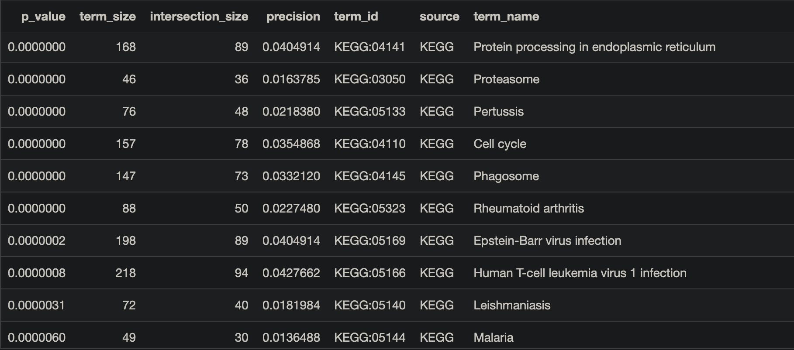

# Introduction

This report outlines the results from my assignment 1, assignment 2, and assignment 3 for the 2025 offering of BCB420. Assignment 1 outlines the dataset and initial preprocessing. Assignment 2 notes how transcriptomic signatures from Chron's disease patients differ from controls in the chosen dataset and provides ranked data to be used in assignment 3. Assignment 3 builds on the analysis from assignment 2 to further examine the transcriptomic features of the dataset.

NOTE: This project assumes the docker is run from the directory "Assignment-3". 

## Background and Data Acquisition
To evaluate differential gene expression in Crohn’s disease (CD), we analyzed RNA-seq data obtained from the Gene Expression Omnibus (GEO) database under accession number GSE233900. This dataset, titled "The Study Of Urban and Rural Crohn disease Evolution (SOURCE)", contains expression profiles from 40 samples representing newly diagnosed Crohn’s disease and healthy control patients from urban and rural regions of China and Israel. Specifically, our analysis includes 20 CD samples and 20 control samples, selected to maximize statistical power and biological heterogeneity.

## Assignment 1 Summary: Data Set Selection and Initial Processing. 

### Data Quality Assessment and Normalization

The primary goal of this phase of the analysis was to normalize the raw count data, ensure its suitability for downstream differential expression testing, and map gene identifiers to standardized gene symbols (HGNC symbols) for interpretation. Using the GEOquery [@davis_2007], edgeR [@yunshunchen_2017], and biomaRt [@smedley_2009] packages in R, we conducted quality control, filtering, normalization, and identifier mapping.

### Data Download and Metadata Parsing

We downloaded the metadata associated with each GSM object using GEOquery, parsing relevant fields such as diagnosis status, patient group, age, and sex. Patient diagnostic labels were extracted and cleaned, revealing an even distribution of CD and control samples. Since the supplemental file on GEO only included TPM-normalized data, raw counts were directly downloaded from the NCBI FTP link for proper normalization procedures. Gene identifiers in the raw counts matched sample GSM IDs, allowing seamless integration with the metadata.

### Initial Quality Assessment and Filtering

The raw count matrix initially contained 39,376 genes across 40 samples. Quality checks included a boxplot of library sizes, density plots of log2 counts per million (CPM), and inspection for genes with low or zero expression. Of the original genes:

    4,531 genes had zero counts across all samples.

    18,752 genes had consistently low expression (CPM < 1 across all samples).

To ensure biological signal without noise from lowly expressed genes, we filtered genes to retain those with CPM > 1 in at least 4 samples, yielding a filtered matrix of 19,118 genes. This threshold, adapted from lecture recommendations [@isserlin_2025], was chosen to preserve sufficient gene coverage for downstream analysis while removing noise.

Post-filtering density plots showed clearer bimodal distributions, and boxplots of log2 CPM values indicated improved consistency across samples, supporting the conclusion that the data is of high technical quality.

### Normalization Using TMM

Next, we created a DGEList object in edgeR and normalized the filtered counts using the Trimmed Mean of M-values (TMM) method. This accounts for library size differences and compositional biases between samples. After normalization, we visualized the transformed data using several diagnostic plots:

    Density Plot: The normalized data maintained a consistent shape across samples, showing overlapping distributions and no outliers, suggesting minimal technical artifacts.

    Boxplot: Post-normalization boxplots showed reduced variability in sample medians, indicating successful scaling of library sizes.

    MDS Plot: A multidimensional scaling (MDS) plot revealed separation between CD and control samples, with the first dimension explaining 27% of the variance and the second explaining 15%, suggesting strong biological differences suitable for differential analysis.

    BCV Plot: The biological coefficient of variation plot confirmed the expected inverse relationship between expression level and variability. The dispersion pattern matched expectations for high-quality RNA-seq data, with a stable common dispersion trend.

    Mean-Variance Plot: This final diagnostic revealed a positive correlation between average expression and variance, validating the assumptions of the negative binomial model used in downstream analysis.

Together, these normalization and filtering steps ensured that the dataset was clean, high-quality, and ready for gene identifier mapping and subsequent differential expression testing. In total, 19,118 genes passed quality control and were normalized for expression analysis in Crohn’s disease versus controls.

### HUGO Gene Mapping

To enable gene identifier mapping from Entrez IDs to HGNC symbols, the Ensembl BioMart database (hsapiens_gene_ensembl) was queried using the biomaRt package [@isserlin_2025]. Due to known instability with the BioMart servers, the connection code was separated and occasionally had to be re-run multiple times to succeed. The mapping was performed by retrieving entrezgene_id and hgnc_symbol attributes, then merging the resulting map with normalized gene expression data (norm_cpm). Genes lacking a corresponding HGNC symbol (n = 2363) were removed to ensure compatibility with downstream analysis tools. Duplicate HGNC symbols, typically resulting from transcript variants, were consolidated by summing expression values across rows sharing the same symbol. This produced a final cleaned dataset containing 16,408 uniquely mapped HGNC genes across all samples, confirming successful mapping and duplicate resolution.

## Assignment 2 Summary: Differential Expression and Enrichment Analysis 

### Introduction and Context

In this analysis, we build on the pre-processed RNA-seq dataset from Assignment 1, derived from GEO accession GSE233900, part of the Study Of Urban and Rural Crohn Disease Evolution (SOURCE). This study profiled ileal biopsies from 40 treatment-naïve individuals—20 Crohn’s disease (CD) patients and 20 healthy controls—spanning rural and urban cohorts in China and Israel. The RNA-seq data was processed using a raw count matrix downloaded directly from the NCBI GEO repository. 

In Assignment 1, we conducted a comprehensive preprocessing pipeline: filtering out low-expression genes (fewer than 1 CPM in at least 4 samples), normalizing using edgeR’s Trimmed Mean of M-values (TMM) method, and mapping gene identifiers to HGNC symbols using biomaRt. This produced a final dataset of 16,408 unique genes across 40 samples, stored in the `final_normalized_counts` object, with metadata (diagnosis, age, sex, and patient group) stored in `sample_metadata`. Diagnostic MDS plots showed good separation between CD and control groups, with the first two dimensions explaining 71% and 10% of total variance, respectively.

---

### Differential Gene Expression Analysis

For Assignment 2, we performed a quasi-likelihood negative binomial generalized linear model (GLM) analysis using edgeR, contrasting CD vs. control samples. With the control group set as the baseline, the model produced log fold-change (logFC) values indicating up- or downregulation in CD samples. Out of 16,408 genes, 8,151 genes (~49.7%) showed nominal significance at p < 0.05. After applying Benjamini-Hochberg correction to control the false discovery rate (FDR < 0.05), 6,886 genes remained statistically significant.

To focus on biologically meaningful genes, we applied fold-change cutoffs:
- |logFC| > 1 & FDR < 0.05 yielded 764 high-confidence DE genes (4.7% of total),
- |logFC| > 0.5 & FDR < 0.05 yielded 2,961 genes, suggesting a strong signal with minimal inflation.

A volcano plot visualized these DEGs, showing a predominance of significantly upregulated genes in CD. Genes like CXCL8, CXCR2, FCGR1A, and ALDH1A2—all previously implicated in gut inflammation or Crohn's pathology—appeared among the top upregulated DEGs.

---

### Heatmap Clustering and Visualization

A heatmap was generated using only FDR-significant DEGs, z-score normalized per gene. Samples clustered according to diagnosis, with distinct expression patterns visible for CD versus control groups. This provided further support for disease-associated transcriptional changes being consistent across biological replicates.

---

### Over-Representation Analysis (ORA)

To identify enriched biological pathways, we performed Over-Representation Analysis (ORA) using the gprofiler2 package, querying KEGG gene sets for:
- Upregulated DEGs (logFC > 0, FDR < 0.05),
- Downregulated DEGs (logFC < 0, FDR < 0.05),
- All DEGs (FDR < 0.05).

Highlights from Upregulated Gene Sets (Table 2):
- Inflammatory Bowel Disease, TNF signaling, IL-17 signaling, and Toll-like receptor pathways were significantly enriched.
- These reflect mucosal inflammation, myeloid activation, and epithelial defense mechanisms—core features of Crohn’s pathogenesis.
- Pathways such as Phagosome, Rheumatoid arthritis, and Helicobacter pylori infection further support a systemic immune activation profile.

Highlights from Downregulated Gene Sets (Table 3):
- Key pathways included Vitamin digestion, Bile secretion, Fat digestion, and Drug metabolism.
- Downregulation of Tight Junctions points to compromised intestinal barrier integrity, supporting a “leaky gut” phenotype observed in Crohn’s disease patients.
- These findings suggest a systemic suppression of metabolic and nutrient processing pathways, potentially contributing to nutrient malabsorption and fatigue in CD.

Overlap Across All DEGs (Table 4):
- Many pathways from Tables 2 and 3 appeared again when all significant DEGs were pooled, suggesting coordinated changes involving both immune activation and metabolic suppression.

---

### Comparison to SOURCE Study Findings

While the original study used TPM-based quantification with WGCNA to identify co-expression modules, our analysis used a gene-wise edgeR model for direct DE testing. Despite methodological differences, notable overlap was observed:
- “Up in Crohn” modules from the SOURCE study involved TNF, IL-17, and TLR pathways—consistent with our upregulated ORA results.
- “Down in Crohn” modules focused on lipid metabolism and mitochondrial structure, aligning with our downregulated KEGG terms (e.g., bile secretion, vitamin absorption).
- Shared top DEGs such as CXCL8 further strengthen the consistency between the studies, despite the use of different normalization and statistical frameworks.

---

### Assignment 2 Conclusion

Assignment 2 demonstrates that the RNA-seq dataset from GSE233900 contains robust transcriptomic signatures distinguishing Crohn’s disease from healthy controls. Differential expression analysis revealed thousands of statistically and biologically relevant genes, supported by strong clustering patterns and enrichment of immune and metabolic pathways. The overlap with the SOURCE study’s systems-level findings underscores the validity of our gene-centric approach. These results support the potential utility of specific genes and pathways as biomarkers or therapeutic targets in Crohn’s disease.

# Package Installation
```{r}
library(circlize)
library(ComplexHeatmap)
library(dplyr)
library(edgeR)
library(ggplot2)
library(gprofiler2)
library(knitr)
library(kableExtra)
library(readr)
library(stringr)
library(DT)
```

# Non-Thresholded Gene Set Enrichment Analysis (GSEA)
In A2, we ranked genes according to differential expression and did over representation analysis. With non-thresholded GSEA we will examine the ranked gene list without a threshold and assess all the genes in the list. Compared to ORA, GSEA is generally more consistent than ORA for identifying enriched pathways between 2 conditions because it considers all genes in an experiment and not just those above some defined cutoff [@chicco_2022]. The two conditions here will be the control group and the Crohn's Disease groups. 

The steps for GSEA are as follows:
- Make a ranked list of genes as a .rnk file to input into GSEA.
- Perform GSEA using the provided in the docker image at "~/GSEA_4.3.2/gsea-cli.sh" [@isserlin_2025; @subramanian_2005].

The chosen annotation file for GSEA is the latest gene set from the Univerisity of Toronto's Bader lab. For GSEA it is generally recommended to use no annotations from electronic annotations (IEA) and no Pathway Figure Optical Character Recognition [@chicco_2022; @isserlin_2025]. As such, the chosen data file does not have these components.

Chosen annotation gene set URL: 
- https://download.baderlab.org/EM_Genesets/March_01_2025/Human/symbol/Human_GOBP_AllPathways_noPFOCR_no_GO_iea_March_01_2025_symbol.gmt

The gene set can be found at this link: https://download.baderlab.org/EM_Genesets/March_01_2025/Human/symbol.

We can download the gmt file in the following way.
```{r message = FALSE, warning=FALSE}
gsea_gmt   <- "~/projects/data/Human_GOBP_AllPathways_noPFOCR_no_GO_iea_March_01_2025_symbol.gmt"

if (!file.exists(gsea_gmt)) {
    gmt_url <- "https://download.baderlab.org/EM_Genesets/March_01_2025/Human/symbol/Human_GOBP_AllPathways_noPFOCR_no_GO_iea_March_01_2025_symbol.gmt"
    download.file(gmt_url, destfile = gsea_gmt)
    print("Successfully downloaded")
}
```


## Making the .rnk file

```{r}
CD_DE_results <- read.csv("CD_DE_results.csv",
                          header = TRUE,
                          stringsAsFactors = FALSE)

head(CD_DE_results)


# Calculating the rank metric
CD_DE_results <- CD_DE_results %>%
  mutate(rank = -log10(PValue) * sign(logFC)) %>%
  arrange(desc(rank))  # sort from highest to lowest rank

gsea_rnk = "~/projects/data/CD_deg.rnk"

# Write out the .rnk file
# NOTE: GSEA preranked mode expects 2 columns, no header line
write.table(
  CD_DE_results[, c("Gene", "rank")],
  file      = gsea_rnk,            
  sep       = "\t",
  row.names = FALSE,
  col.names = FALSE,  # important! GSEA doesn’t want a header row
  quote     = FALSE
)

head(CD_DE_results)
```

## Performing GSEA
Following the homework assignment, GSEA is performed with the parameters below:
- Max size: 200
- Min size: 15
Additionally, the default number of permutations used to calculate a p-value is 1000.

```{r message = FALSE, warning=FALSE}
# Set gsea output to CD
gsea_dir   <- "~/projects/data/CD" 
gsea_gmt   <- "~/projects/data/Human_GOBP_AllPathways_noPFOCR_no_GO_iea_March_01_2025_symbol.gmt"
gsea_exe   <- "~/GSEA_4.3.2/gsea-cli.sh"

# GSEA parameters
max_size <- 200
min_size <- 15
permutations <- 1000 # Default value isted for clarity

analysis_name <- "CDvsCON"


# Build the command to run GSEA in preranked mode
gsea_cmd <- paste(
  gsea_exe, "GSEAPreranked",
  "-collapse false",
  "-gmx", gsea_gmt,
  "-nperm", permutations,
  "-out", gsea_dir,
  "-plot_top_x 20 -rnd_seed 12345",
  "-rnk", gsea_rnk,
  "-rpt_label", analysis_name,
  "-scoring_scheme weighted",
  "-set_max", max_size,
  "-set_min", min_size,
  "-zip_report false"
)

# Avoid rerunning GSEA when marking
path_gsea_output <- file.path(gsea_dir, "CDvsCON.GseaPreranked")
if (!file.exists(path_gsea_output)) {
  system(gsea_cmd)  # runs the GSEA command
}

```
The time stamp for path_gsea_output is added to the end of the analysis. I have copied the path of the analysis I did here. Lets read in the results.

```{r}
path_gsea_output <- file.path(gsea_dir, "CDvsCON.GseaPreranked.1743299144940")


# Reading the GSEA output for upregulated / positive enrichments
cd_up_reg <- read.table(
  file = "~/projects/data/CD/CDvsCON.GseaPreranked.1743299144940/gsea_report_for_na_pos_1743299144940.tsv",
  sep = "\t", header = TRUE, fill = TRUE
)

# Reading the GSEA output for downregulated / negative enrichments
cd_neg_reg <- read.table(
  file = "~/projects/data/CD/CDvsCON.GseaPreranked.1743299144940/gsea_report_for_na_neg_1743299144940.tsv",
  sep = "\t", header = TRUE, fill = TRUE
)
```

## Summarizing Enrichment Results

Before summarizing the results in a table, lets see how many genes are above and below a standard FDR threshold of 0.05 [@love_2014]. While it may be overly strict in some cases, it can be used to note the number of significant pathways, we will use it as our threshold for significance when counting the total number of significant pathways [@love_2014].

```{r}
# Number of significantly upregulated pathways (FDR q-value < 0.05)
num_up_sig <- cd_up_reg %>% filter(FDR.q.val < 0.05) %>% nrow()

# Number of significantly downregulated pathways (FDR q-value < 0.05)
num_down_sig <- cd_neg_reg %>% filter(FDR.q.val < 0.05) %>% nrow()

num_up_sig2 <- cd_up_reg %>% filter(FDR.q.val < 0.001) %>% nrow()

# Display results
cat("Number of significantly upregulated pathways (FDR < 0.05):", num_up_sig, "\n")
cat("Number of significantly downregulated pathways (FDR < 0.05):", num_down_sig, "\n")
cat("Number of significantly upregulated pathways (FDR < 0.001):", num_up_sig2, "\n")

```
Given the large number of significantly up and downregulated pathways, lets summarize the top entries in a truncated table.

Lets first summarize the upregulated set in a table. 

```{r}
# Summarize upregulated sets
CDupreg_table <- cd_up_reg %>%
  select(NAME, SIZE, ES, FDR.q.val) %>%
  rename(
    "Gene Set"         = NAME,
    "Size"             = SIZE,
    "Enrichment Score" = ES,
    "FDR q-value"      = FDR.q.val
  ) %>%
  
  # Removes the part of each "Gene Set" string that starts with a % and everything after it
  mutate(`Gene Set` = str_remove(`Gene Set`, "%.*$")) %>%
  mutate(`Gene Set` = str_to_sentence(`Gene Set`)) %>%
  arrange(`FDR q-value`) %>%
  dplyr::slice_head(n = 25) # Remove this to display full table

# Display the table
kable(CDupreg_table, caption = "Table 1: Top 25 Upregulated Gene Sets by FDR q-value")
```

Now lets summarize the downregulated set in a table. 

```{r}
# Summarize downregulated sets (top 25 only)
CDnegreg_table <- cd_neg_reg %>%
  dplyr::select(NAME, SIZE, ES, FDR.q.val) %>%
  dplyr::rename(
    "Gene Set"         = NAME,
    "Size"             = SIZE,
    "Enrichment Score" = ES,
    "FDR q-value"      = FDR.q.val
  ) %>%
  
  # Removes the part of each "Gene Set" string that starts with a % and everything after it
  dplyr::mutate(`Gene Set` = stringr::str_remove(`Gene Set`, "%.*$")) %>%
  dplyr::mutate(`Gene Set` = stringr::str_to_sentence(`Gene Set`)) %>%
  dplyr::arrange(`FDR q-value`) %>%
  dplyr::slice_head(n = 25)

# Display table using kable
kable(CDnegreg_table, caption = "Table 2: Top 25 Downregulated Gene Sets by FDR q-value")
```
It is interesting that Glucuronidation appears as a pathway twice.

Given the large number of genes below the FDR threshold of 0.05, lets examine only the top entries arranged by enrichment score while also being below the threshold.

We start by doing this for the upregulated sets.

```{r}
top_CDupreg <- CDupreg_table %>%
  filter(`FDR q-value` < 0.05) %>%
  arrange(desc(`Enrichment Score`))

# Display the table interactively, so no need to truncate
DT::datatable(top_CDupreg, rownames = FALSE, filter = "top",
              options = list(pageLength = 10, scrollX = TRUE)) %>%
  DT::formatStyle(names(top_CDupreg), fontSize = "12px")

```


## How these results compare to results from Assignment 2



```{r fig.cap="Top 10 over-representation analysis (ORA) results for upregulated genes in Crohn's disease (CD) samples, based on KEGG pathway enrichment. The figure displays the pathway size, overlap with input genes (intersection size), precision, and KEGG term ID for each enriched pathway.", out.width="100%"}

```


# Non-thresholded Gene Set Enrichment Analysis

## Methods and Gene Sets Used  
## Summary of Enrichment Results  
## Comparison to Thresholded Analysis (Assignment 2)  

# Visualization of Enrichment Results in Cytoscape

## Enrichment Map Creation  
### Node and Edge Counts  
### Thresholds Used  
### Screenshot of Initial Network  

## Network Annotation  
### Parameters Used for Annotation  

## Publication-ready Figure  
### Figure and Legend  

## Theme Network (Collapsed View)  
### Major Themes  
### Fit with the Model  
### Novel Pathways or Themes  

# Interpretation and Detailed View of Results

## Comparison to Original Paper  
## Comparison to Thresholded Results (Assignment 2)  
## Literature Support for Observed Pathways  

# Post-Analysis Exploration

## Option 1: Transcription Factors / microRNAs / Drugs  
### Rationale and Supporting Publications  
### Results of Post-analysis  

## Option 2: Detailed Exploration of a Specific Pathway or Theme  
### Justification for Choice  
### Network or Pathway Diagram  
### Annotation with Fold Change and p-values  

## Option 3: Dark Matter Genes  
### Heatmap: Genes Not Annotated in Returned Pathways  
### Heatmap: Genes Not Annotated in Entire Pathway Set  

# References

