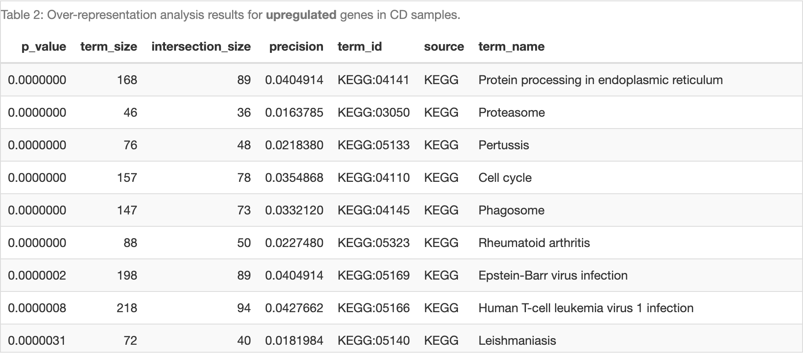
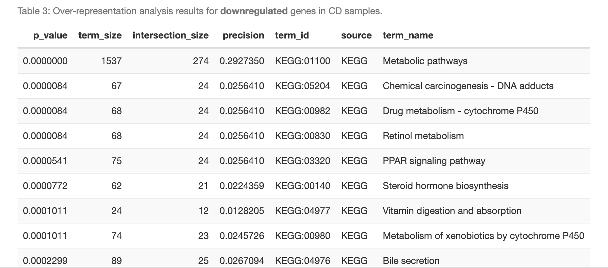
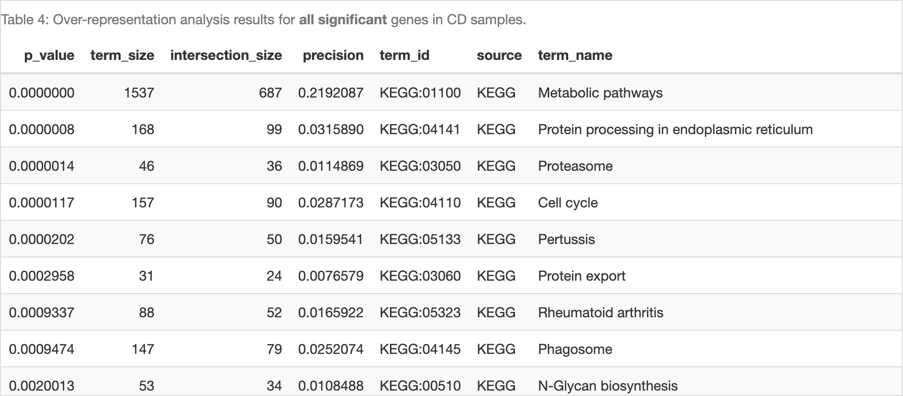
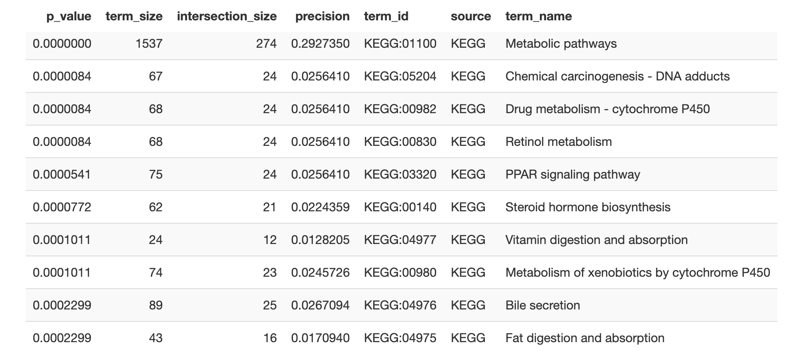
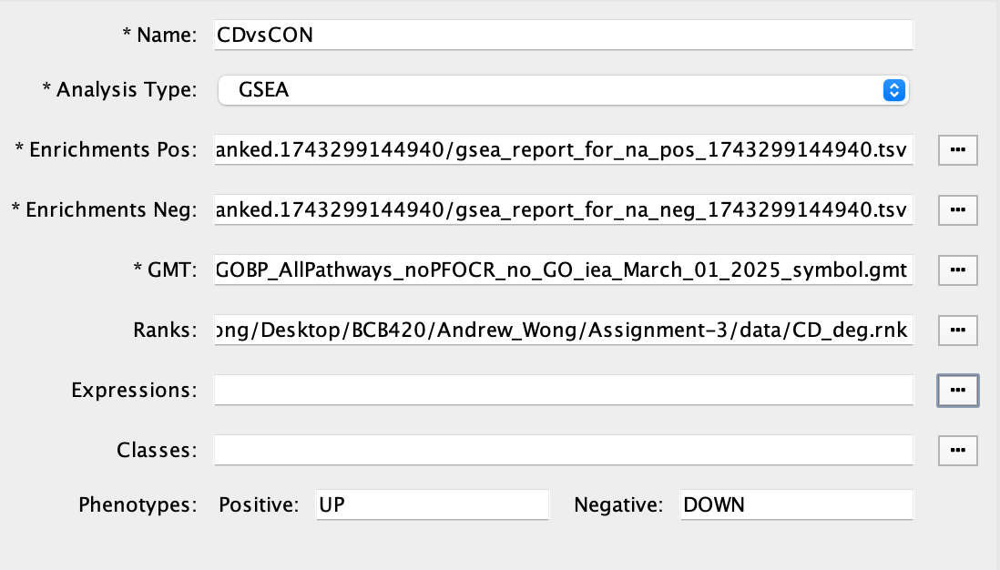
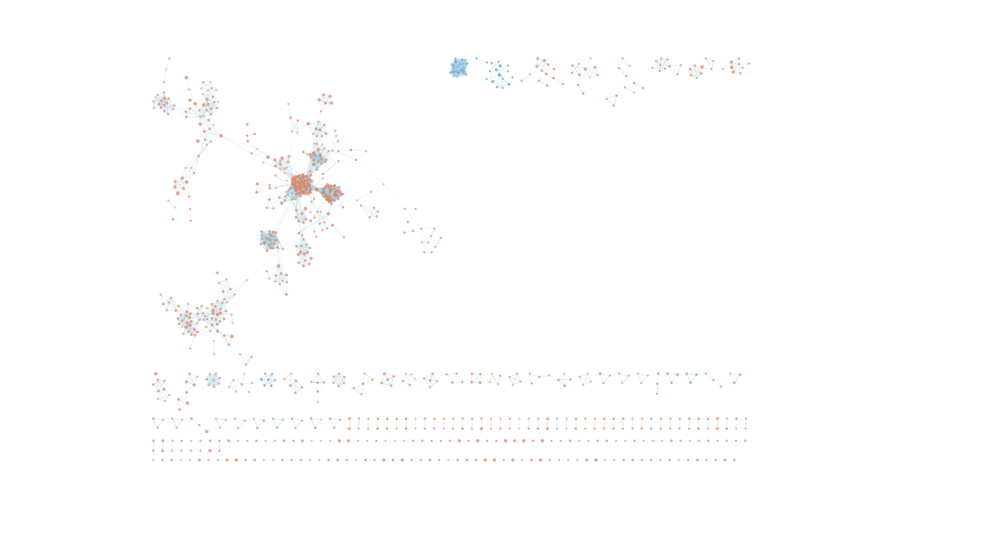
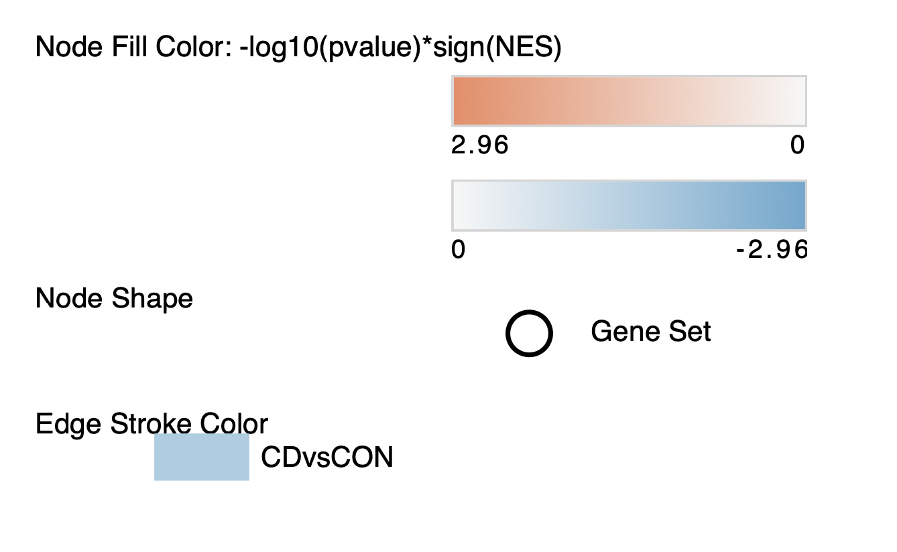
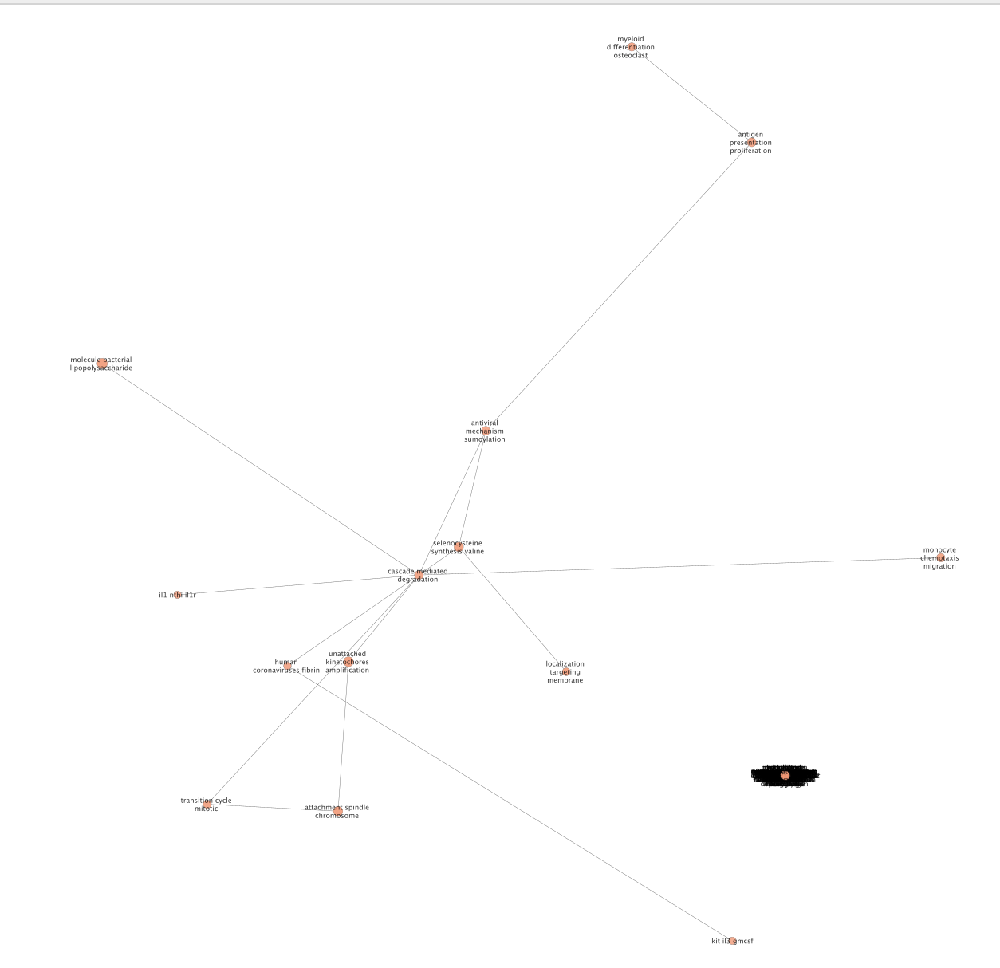

# Introduction

This report outlines the results from my assignment 1, assignment 2, and assignment 3 for the 2025 offering of BCB420. Assignment 1 outlines the dataset and initial preprocessing. Assignment 2 notes how transcriptomic signatures from Chron's disease patients differ from controls in the chosen dataset and provides ranked data to be used in assignment 3. Assignment 3 builds on the analysis from assignment 2 to further examine the transcriptomic features of the dataset.

NOTE: This project assumes the docker is run from the directory "Assignment-3".

## Background and Data Acquisition

To evaluate differential gene expression in Crohn’s disease (CD), we analyzed RNA-seq data obtained from the Gene Expression Omnibus (GEO) database under accession number GSE233900. This dataset, titled "The Study Of Urban and Rural Crohn disease Evolution (SOURCE)", contains expression profiles from 40 samples representing newly diagnosed Crohn’s disease and healthy control patients from urban and rural regions of China and Israel. Specifically, our analysis includes 20 CD samples and 20 control samples, selected to maximize statistical power and biological heterogeneity.

## Assignment 1 Summary: Data Set Selection and Initial Processing.

### Data Quality Assessment and Normalization

The primary goal of this phase of the analysis was to normalize the raw count data, ensure its suitability for downstream differential expression testing, and map gene identifiers to standardized gene symbols (HGNC symbols) for interpretation. Using the GEOquery [@davis_2007], edgeR [@yunshunchen_2017], and biomaRt [@smedley_2009] packages in R, we conducted quality control, filtering, normalization, and identifier mapping.

### Data Download and Metadata Parsing

We downloaded the metadata associated with each GSM object using GEOquery, parsing relevant fields such as diagnosis status, patient group, age, and sex. Patient diagnostic labels were extracted and cleaned, revealing an even distribution of CD and control samples. Since the supplemental file on GEO only included TPM-normalized data, raw counts were directly downloaded from the NCBI FTP link for proper normalization procedures. Gene identifiers in the raw counts matched sample GSM IDs, allowing seamless integration with the metadata.

### Initial Quality Assessment and Filtering

The raw count matrix initially contained 39,376 genes across 40 samples. Quality checks included a boxplot of library sizes, density plots of log2 counts per million (CPM), and inspection for genes with low or zero expression. Of the original genes:

    4,531 genes had zero counts across all samples.

    18,752 genes had consistently low expression (CPM < 1 across all samples).

To ensure biological signal without noise from lowly expressed genes, we filtered genes to retain those with CPM > 1 in at least 4 samples, yielding a filtered matrix of 19,118 genes. This threshold, adapted from lecture recommendations [@isserlin_2025], was chosen to preserve sufficient gene coverage for downstream analysis while removing noise.

Post-filtering density plots showed clearer bimodal distributions, and boxplots of log2 CPM values indicated improved consistency across samples, supporting the conclusion that the data is of high technical quality.

### Normalization Using TMM

Next, we created a DGEList object in edgeR and normalized the filtered counts using the Trimmed Mean of M-values (TMM) method. This accounts for library size differences and compositional biases between samples. After normalization, we visualized the transformed data using several diagnostic plots:

    Density Plot: The normalized data maintained a consistent shape across samples, showing overlapping distributions and no outliers, suggesting minimal technical artifacts.

    Boxplot: Post-normalization boxplots showed reduced variability in sample medians, indicating successful scaling of library sizes.

    MDS Plot: A multidimensional scaling (MDS) plot revealed separation between CD and control samples, with the first dimension explaining 27% of the variance and the second explaining 15%, suggesting strong biological differences suitable for differential analysis.

    BCV Plot: The biological coefficient of variation plot confirmed the expected inverse relationship between expression level and variability. The dispersion pattern matched expectations for high-quality RNA-seq data, with a stable common dispersion trend.

    Mean-Variance Plot: This final diagnostic revealed a positive correlation between average expression and variance, validating the assumptions of the negative binomial model used in downstream analysis.

Together, these normalization and filtering steps ensured that the dataset was clean, high-quality, and ready for gene identifier mapping and subsequent differential expression testing. In total, 19,118 genes passed quality control and were normalized for expression analysis in Crohn’s disease versus controls.

### HUGO Gene Mapping

To enable gene identifier mapping from Entrez IDs to HGNC symbols, the Ensembl BioMart database (hsapiens_gene_ensembl) was queried using the biomaRt package [@isserlin_2025]. Due to known instability with the BioMart servers, the connection code was separated and occasionally had to be re-run multiple times to succeed. The mapping was performed by retrieving entrezgene_id and hgnc_symbol attributes, then merging the resulting map with normalized gene expression data (norm_cpm). Genes lacking a corresponding HGNC symbol (n = 2363) were removed to ensure compatibility with downstream analysis tools. Duplicate HGNC symbols, typically resulting from transcript variants, were consolidated by summing expression values across rows sharing the same symbol. This produced a final cleaned dataset containing 16,408 uniquely mapped HGNC genes across all samples, confirming successful mapping and duplicate resolution.

## Assignment 2 Summary: Differential Expression and Enrichment Analysis

### Introduction and Context

In this analysis, we build on the pre-processed RNA-seq dataset from Assignment 1, derived from GEO accession GSE233900, part of the Study Of Urban and Rural Crohn Disease Evolution (SOURCE). This study profiled ileal biopsies from 40 treatment-naïve individuals—20 Crohn’s disease (CD) patients and 20 healthy controls—spanning rural and urban cohorts in China and Israel. The RNA-seq data was processed using a raw count matrix downloaded directly from the NCBI GEO repository.

In Assignment 1, we conducted a comprehensive preprocessing pipeline: filtering out low-expression genes (fewer than 1 CPM in at least 4 samples), normalizing using edgeR’s Trimmed Mean of M-values (TMM) method, and mapping gene identifiers to HGNC symbols using biomaRt. This produced a final dataset of 16,408 unique genes across 40 samples, stored in the `final_normalized_counts` object, with metadata (diagnosis, age, sex, and patient group) stored in `sample_metadata`. Diagnostic MDS plots showed good separation between CD and control groups, with the first two dimensions explaining 71% and 10% of total variance, respectively.

---

### Differential Gene Expression Analysis

For Assignment 2, we performed a quasi-likelihood negative binomial generalized linear model (GLM) analysis using edgeR, contrasting CD vs. control samples. With the control group set as the baseline, the model produced log fold-change (logFC) values indicating up- or downregulation in CD samples. Out of 16,408 genes, 8,151 genes (~49.7%) showed nominal significance at p < 0.05. After applying Benjamini-Hochberg correction to control the false discovery rate (FDR < 0.05), 6,886 genes remained statistically significant.

To focus on biologically meaningful genes, we applied fold-change cutoffs:

- |logFC| > 1 & FDR < 0.05 yielded 764 high-confidence DE genes (4.7% of total),
- |logFC| > 0.5 & FDR < 0.05 yielded 2,961 genes, suggesting a strong signal with minimal inflation.

A volcano plot visualized these DEGs, showing a predominance of significantly upregulated genes in CD. Genes like CXCL8, CXCR2, FCGR1A, and ALDH1A2—all previously implicated in gut inflammation or Crohn's pathology—appeared among the top upregulated DEGs.

---

### Heatmap Clustering and Visualization

A heatmap was generated using only FDR-significant DEGs, z-score normalized per gene. Samples clustered according to diagnosis, with distinct expression patterns visible for CD versus control groups. This provided further support for disease-associated transcriptional changes being consistent across biological replicates.

---

### Over-Representation Analysis (ORA)

To identify enriched biological pathways, we performed Over-Representation Analysis (ORA) using the gprofiler2 package, querying KEGG gene sets for:

- Upregulated DEGs (logFC > 0, FDR < 0.05),
- Downregulated DEGs (logFC < 0, FDR < 0.05),
- All DEGs (FDR < 0.05).

```{r fig.cap="Table 2 from Assignment-2. The top 10 over-representation analysis (ORA) results for upregulated genes in Crohn's disease (CD) samples, based on KEGG pathway enrichment.", out.width="100%"}

```

Highlights from Upregulated Gene Sets (Table 2 in A2):

- Inflammatory Bowel Disease, TNF signaling, IL-17 signaling, and Toll-like receptor pathways were significantly enriched.
- These reflect mucosal inflammation, myeloid activation, and epithelial defense mechanisms—core features of Crohn’s pathogenesis.
- Pathways such as Phagosome, Rheumatoid arthritis, and Helicobacter pylori infection further support a systemic immune activation profile.

```{r fig.cap="Table 3 from Assignment-2. The top 10 over-representation analysis (ORA) results for downregulated genes in Crohn's disease (CD) samples, based on KEGG pathway enrichment.", out.width="100%"}

```

Highlights from Downregulated Gene Sets (Table 3):

- Key pathways included Vitamin digestion, Bile secretion, Fat digestion, and Drug metabolism.
- Downregulation of Tight Junctions points to compromised intestinal barrier integrity, supporting a “leaky gut” phenotype observed in Crohn’s disease patients.
- These findings suggest a systemic suppression of metabolic and nutrient processing pathways, potentially contributing to nutrient malabsorption and fatigue in CD.

```{r fig.cap="Table 4 from Assignment-2. The top 10 over-representation analysis (ORA) results for all differentially expressed genes (DEGs) in Crohn's disease (CD) samples, based on KEGG pathway enrichment.", out.width="100%"}

```

Overlap Across All DEGs (Table 4):

- Many pathways from Tables 2 and 3 appeared again when all significant DEGs were pooled, suggesting coordinated changes involving both immune activation and metabolic suppression.

---

### Comparison to SOURCE Study Findings

While the original study used TPM-based quantification with WGCNA to identify co-expression modules, our analysis used a gene-wise edgeR model for direct DE testing. Despite methodological differences, notable overlap was observed:

- “Up in Crohn” modules from the SOURCE study involved TNF, IL-17, and TLR pathways—consistent with our upregulated ORA results.
- “Down in Crohn” modules focused on lipid metabolism and mitochondrial structure, aligning with our downregulated KEGG terms (e.g., bile secretion, vitamin absorption).
- Shared top DEGs such as CXCL8 further strengthen the consistency between the studies, despite the use of different normalization and statistical frameworks.

---

### Assignment 2 Conclusion

Assignment 2 demonstrates that the RNA-seq dataset from GSE233900 contains robust transcriptomic signatures distinguishing Crohn’s disease from healthy controls. Differential expression analysis revealed thousands of statistically and biologically relevant genes, supported by strong clustering patterns and enrichment of immune and metabolic pathways. The overlap with the SOURCE study’s systems-level findings underscores the validity of our gene-centric approach. These results support the potential utility of specific genes and pathways as biomarkers or therapeutic targets in Crohn’s disease.

# Package Installation

```{r}
library(circlize)
library(ComplexHeatmap)
library(dplyr)
library(edgeR)
library(ggplot2)
library(gprofiler2)
library(knitr)
library(kableExtra)
library(readr)
library(stringr)
library(DT)
```

# Non-Thresholded Gene Set Enrichment Analysis (GSEA)

In A2, we ranked genes according to differential expression and did over representation analysis. With non-thresholded GSEA we will examine the ranked gene list without a threshold and assess all the genes in the list. Compared to ORA, GSEA is generally more consistent than ORA for identifying enriched pathways between 2 conditions because it considers all genes in an experiment and not just those above some defined cutoff [@chicco_2022]. The two conditions here will be the control group and the Crohn's Disease groups.

The steps for GSEA are as follows:

- Make a ranked list of genes as a .rnk file to input into GSEA.
- Perform GSEA using the provided in the docker image at "~/GSEA_4.3.2/gsea-cli.sh" [@isserlin_2025; @subramanian_2005].

The chosen annotation file for GSEA is the latest gene set from the Univerisity of Toronto's Bader lab. For GSEA it is generally recommended to use no annotations from electronic annotations (IEA) and no Pathway Figure Optical Character Recognition [@chicco_2022; @isserlin_2025]. As such, the chosen data file does not have these components.

Chosen annotation gene set URL:

- https://download.baderlab.org/EM_Genesets/March_01_2025/Human/symbol/Human_GOBP_AllPathways_noPFOCR_no_GO_iea_March_01_2025_symbol.gmt

The gene set can be found at this link: https://download.baderlab.org/EM_Genesets/March_01_2025/Human/symbol.

We can download the gmt file in the following way.

```{r message = FALSE, warning=FALSE}
gsea_gmt   <- "~/projects/data/Human_GOBP_AllPathways_noPFOCR_no_GO_iea_March_01_2025_symbol.gmt"

if (!file.exists(gsea_gmt)) {
    gmt_url <- "https://download.baderlab.org/EM_Genesets/March_01_2025/Human/symbol/Human_GOBP_AllPathways_noPFOCR_no_GO_iea_March_01_2025_symbol.gmt"
    download.file(gmt_url, destfile = gsea_gmt)
    print("Successfully downloaded")
}
```

## Making the .rnk file

```{r}
CD_DE_results <- read.csv("CD_DE_results.csv",
                          header = TRUE,
                          stringsAsFactors = FALSE)

head(CD_DE_results)


# Calculating the rank metric
CD_DE_results <- CD_DE_results %>%
  mutate(rank = -log10(PValue) * sign(logFC)) %>%
  arrange(desc(rank))  # sort from highest to lowest rank

gsea_rnk = "~/projects/data/CD_deg.rnk"

# Write out the .rnk file
# NOTE: GSEA preranked mode expects 2 columns, no header line
write.table(
  CD_DE_results[, c("Gene", "rank")],
  file      = gsea_rnk,
  sep       = "\t",
  row.names = FALSE,
  col.names = FALSE,  # important! GSEA doesn’t want a header row
  quote     = FALSE
)

head(CD_DE_results)
```

## Performing GSEA

Following the homework assignment, GSEA is performed with the parameters below:

- Max size: 200
- Min size: 15
  Additionally, the default number of permutations used to calculate a p-value is 1000.

```{r message = FALSE, warning=FALSE}
# Set gsea output to CD
gsea_dir   <- "~/projects/data/CD"
gsea_gmt   <- "~/projects/data/Human_GOBP_AllPathways_noPFOCR_no_GO_iea_March_01_2025_symbol.gmt"
gsea_exe   <- "~/GSEA_4.3.2/gsea-cli.sh"

# GSEA parameters
max_size <- 200
min_size <- 15
permutations <- 1000 # Default value isted for clarity

analysis_name <- "CDvsCON"


# Build the command to run GSEA in preranked mode
gsea_cmd <- paste(
  gsea_exe, "GSEAPreranked",
  "-collapse false",
  "-gmx", gsea_gmt,
  "-nperm", permutations,
  "-out", gsea_dir,
  "-plot_top_x 20 -rnd_seed 12345",
  "-rnk", gsea_rnk,
  "-rpt_label", analysis_name,
  "-scoring_scheme weighted",
  "-set_max", max_size,
  "-set_min", min_size,
  "-zip_report false"
)

# Avoid rerunning GSEA when marking
path_gsea_output <- file.path(gsea_dir, "CDvsCON.GseaPreranked")
if (!file.exists(path_gsea_output)) {
  system(gsea_cmd)  # runs the GSEA command
}

```

The time stamp for path_gsea_output is added to the end of the analysis. I have copied the path of the analysis I did here. Lets read in the results.

```{r}
path_gsea_output <- file.path(gsea_dir, "CDvsCON.GseaPreranked.1743299144940")


# Reading the GSEA output for upregulated / positive enrichments
cd_up_reg <- read.table(
  file = "~/projects/data/CD/CDvsCON.GseaPreranked.1743299144940/gsea_report_for_na_pos_1743299144940.tsv",
  sep = "\t", header = TRUE, fill = TRUE
)

# Reading the GSEA output for downregulated / negative enrichments
cd_neg_reg <- read.table(
  file = "~/projects/data/CD/CDvsCON.GseaPreranked.1743299144940/gsea_report_for_na_neg_1743299144940.tsv",
  sep = "\t", header = TRUE, fill = TRUE
)
```

## Summarizing Enrichment Results

Before summarizing the results in a table, lets see how many genes are above and below a standard FDR threshold of 0.05 [@love_2014]. While it may be overly strict in some cases, it can be used to note the number of significant pathways, we will use it as our threshold for significance when counting the total number of significant pathways [@love_2014].

```{r}
# Number of significantly upregulated pathways (FDR q-value < 0.05)
num_up_sig <- cd_up_reg %>% filter(FDR.q.val < 0.05) %>% nrow()

# Number of significantly downregulated pathways (FDR q-value < 0.05)
num_down_sig <- cd_neg_reg %>% filter(FDR.q.val < 0.05) %>% nrow()

num_up_sig2 <- cd_up_reg %>% filter(FDR.q.val < 0.001) %>% nrow()

# Display results
cat("Number of significantly upregulated pathways (FDR < 0.05):", num_up_sig, "\n")
cat("Number of significantly downregulated pathways (FDR < 0.05):", num_down_sig, "\n")
cat("Number of significantly upregulated pathways (FDR < 0.001):", num_up_sig2, "\n")

```

Given the large number of significantly up and downregulated pathways, lets summarize the top entries in a truncated table.

Lets first summarize the upregulated set in a table.

```{r}
# Summarize upregulated sets
CDupreg_table <- cd_up_reg %>%
  select(NAME, SIZE, ES, FDR.q.val) %>%
  rename(
    "Gene Set"         = NAME,
    "Size"             = SIZE,
    "Enrichment Score" = ES,
    "FDR q-value"      = FDR.q.val
  ) %>%

  # Removes the part of each "Gene Set" string that starts with a % and everything after it
  mutate(`Gene Set` = str_remove(`Gene Set`, "%.*$")) %>%
  mutate(`Gene Set` = str_to_sentence(`Gene Set`)) %>%
  arrange(`FDR q-value`) %>%
  dplyr::slice_head(n = 25) # Remove this to display full table

# Display the table
kable(CDupreg_table, caption = "Table 1: Top 25 Upregulated Gene Sets by FDR q-value")
```

Now lets summarize the downregulated set in a table.

```{r}
# Summarize downregulated sets (top 25 only)
CDnegreg_table <- cd_neg_reg %>%
  dplyr::select(NAME, SIZE, ES, FDR.q.val) %>%
  dplyr::rename(
    "Gene Set"         = NAME,
    "Size"             = SIZE,
    "Enrichment Score" = ES,
    "FDR q-value"      = FDR.q.val
  ) %>%

  # Removes the part of each "Gene Set" string that starts with a % and everything after it
  dplyr::mutate(`Gene Set` = stringr::str_remove(`Gene Set`, "%.*$")) %>%
  dplyr::mutate(`Gene Set` = stringr::str_to_sentence(`Gene Set`)) %>%
  dplyr::arrange(`FDR q-value`) %>%
  dplyr::slice_head(n = 25)

# Display table using kable
kable(CDnegreg_table, caption = "Table 2: Top 25 Downregulated Gene Sets by FDR q-value")
```

It is interesting that Glucuronidation appears as a pathway twice. It likely means that it's present with the same name under two different gene sets given that the Bader lab annotation set is compiled from multiple gene set sources including GO Biological Process and Reactome[@isserlin_2025].

Given the large number of genes below the FDR threshold of 0.05, lets examine only the top entries arranged by enrichment score while also being below the threshold.

We start by doing this for the upregulated sets.

```{r}
top_CDupreg <- CDupreg_table %>%
  filter(`FDR q-value` < 0.05) %>%
  arrange(desc(`Enrichment Score`))

# Display the table interactively, so no need to truncate
htmltools::tags$h4("Table 3. Top upregulated gene sets (FDR q-value < 0.05), sorted by enrichment score. Displayed interactively with filtering.")
DT::datatable(top_CDupreg, rownames = FALSE, filter = "top",
              options = list(pageLength = 10, scrollX = TRUE)) %>%
  DT::formatStyle(names(top_CDupreg), fontSize = "12px")
```

At a glance, many of the pathways noted in the top 10 and top 100 entries relate to Crohn's disease. Similar to assignment 2, many of the pathways relate to inflammation and epithelial cells. Here are some of the pathways I examined further.

1. Lipopolysaccharide‐mediated signaling pathway (Index 1)

- Lipopolysaccharide (LPS) is a key component of Gram‐negative bacterial cell walls. LPS recognition (via TLR4, among other sensors) triggers potent inflammatory cascades. Given that the gut in Crohn’s harbors an altered microbiota and increased epithelial permeability, LPS‐induced inflammation is a central player in driving the chronic immune response [@stephens_2020].

2. Inflammatory response to antigenic stimulus (Index 5) / Acute inflammatory response (Index 6)

- Crohn’s features ongoing mucosal inflammation in response to luminal antigens (bacteria, dietary proteins). Both the general “inflammatory response” and its acute phase are routinely triggered in intestinal tissue affected by Crohn’s [@bamias_2021].

3. Chemokine receptors bind chemokines (Index 8)

- Chemokine‐mediated cell migration is related to the infiltration of T cells, neutrophils, monocytes, and other immune cells into the inflamed gut wall. Elevated chemokine expression and chemokine receptor signaling are well‐known in Crohn’s lesions [@kopiasz_2022].

4. Leukocyte activation involved in inflammatory response (Index 24)

- Pathogenic T helper cells, macrophages, dendritic cells, and neutrophils all become activated in Crohn’s intestinal tissue, producing cytokines (TNF, IL‐1β, IL‐6, IL‐23, etc.) that perpetuate tissue injury and inflammation [@atreya_2024; @pagnini_2021].

5. Endogenous TLR signaling (Index 26) / Toll like receptor signaling related to myd88 (Index 63)

- Toll‐like receptors are frontline sensors for microbial products. Dysregulated TLR signaling contributes to the inappropriate or excessive immune responses to gut flora seen in Crohn’s [@lu_2018]. The MyD88‐dependent branch (Index 63) is one of TLR’s major routes for driving proinflammatory cytokine production [@lu_2018].

6. Response to interferon‐beta (Index 31) / Response to type II interferon (IFN‐γ) (Index 34) / Type II interferon signaling (Index 45)

- Crohn’s has features of both Th1‐ (dominated by IFN‐γ) and Th17‐type inflammation [@strober_2010]. IFN‐β (type I) can modulate inflammation, while IFN‐γ (type II) is a well‐recognized driver of macrophage activation and tissue damage in Crohn’s [@strober_2010].

We can create the same table for downregulated pathways. Note that we arrange enrichment score in ascending order instead of descending since a higher negative value signifies stronger downregulation enrichment [@subramanian_2005].

```{r}
top_CDdownreg <- CDnegreg_table %>%
  filter(`FDR q-value` < 0.05) %>%
  arrange(`Enrichment Score`)

kable(top_CDdownreg)
# Display the table interactively, so no need to truncate
htmltools::tags$h4("Table 4. Top downregulated gene sets (FDR q-value < 0.05), sorted by enrichment score. Displayed interactively with filtering.")
DT::datatable(top_CDdownreg, rownames = FALSE, filter = "top",
              options = list(pageLength = 10, scrollX = TRUE)) %>%
  DT::formatStyle(names(top_CDupreg), fontSize = "12px")
```

## How these results compare to results from Assignment 2

### Up Regulated genes

```{r fig.cap="Top 10 over-representation analysis (ORA) results for upregulated genes in Crohn's disease (CD) samples, based on KEGG pathway enrichment. The figure displays the pathway size, overlap with input genes (intersection size), precision, and KEGG term ID for each enriched pathway.", out.width="100%"}
knitr::include_graphics("image.png")
```

Here is a truncated image of the table used in assignment 2 for the up regulated ORA results. Many of the Crohn's disease related pathways are shared between the two lists. I have mapped a few of the pathways from the ORA analysis to the GSEA results below, not all are necessarily Crohn's related.

ORA #2 – “Proteasome”

- GSEA #65 – “Proteasome degradation”
  These both describe the same core process of protein degradation by the 20S/26S proteasome. The proteasome pathway is related to Crohn's disease through its role in inflammation and immune regulation, particularly by promoting NF-κB activation and antigen processing [@chen_2022].

ORA #26 – “Toll-like receptor signaling pathway”

- GSEA #63 – “Toll like receptor signaling related to myd88”
  GSEA’s set is essentially the MyD88‐dependent branch of TLR signaling, so it overlaps closely with the broader KEGG “Toll-like receptor signaling pathway.” As noted in the eariler upregulated section, it is closely related to the hyperactive immune responses seen in Crohn's disease[@lu_2018].

ORA #31 – “Aminoacyl-tRNA biosynthesis”

- GSEA #64 – “Cytosolic tRNA aminoacylation”
  Both refer to charging tRNAs with amino acids. KEGG’s pathway name is the standard term; GSEA’s label just specifies the cytosolic branch of that same process[@kopiasz_2022].

ORA #34 – “Antigen processing and presentation”

- GSEA #62 – “Antigen processing and presentation of endogenous peptide antigen via MHC class I”
  GSEA focuses on the class I–restricted route; KEGG’s title covers both MHC I and II, but the functional overlap is clear. As antigen processessing and presentation, especially part of MHC class I, are part of immune responses related to Crohn's disease, this is another shared gene set related to Crohn's samples [@atreya_2024; @pagnini_2021].

ORA #56 – “Ubiquitin mediated proteolysis”

- GSEA #33 – “Ubiquitin proteasome pathway”
  These both describe ubiquitin‐dependent protein turnover via the E1–E2–E3 enzymatic cascade and subsequent proteasomal degradation.

### Down Regulated Genes

```{r fig.cap="Top 10 over-representation analysis (ORA) results for downregulated genes in Crohn's disease (CD) samples, based on KEGG pathway enrichment. The figure displays the pathway size, overlap with input genes (intersection size), precision, and KEGG term ID for each enriched pathway.", out.width="100%"}

```

Here is a truncated image of the table used in assignment 2 for the downregulated ORA results. Many of the Crohn's disease related pathways are shared between the two lists. I have mapped a few of the pathways from the ORA analysis to the GSEA results below, noting the rank / indexes of each pathway. Note that not all are necessarily Crohn's related.

ABC Transporters

- ORA #21: KEGG:02010 “ABC transporters”
- GSEA (Index 1): “Abc transporters in lipid homeostasis”
  These both center on ATP‐binding cassette (ABC) transporter proteins that facilitate the movement of lipids, vitamins, bile acids, and xenobiotics across membranes. The transporter is known to be impacted, largely with reduced function, in Crohn's disease [@andersen_2015].

Drug / Xenobiotic Metabolism via Cytochrome P450

- ORA #3 & #8: “Drug metabolism – cytochrome P450,” “Metabolism of xenobiotics by cytochrome P450,” plus #2 “Chemical carcinogenesis – DNA adducts” and #26 “Chemical carcinogenesis – receptor activation”
- GSEA (Indexes 7, 18, 23, 24): “Xenobiotic catabolic process,” “Oxidation by cytochrome p450,” “Xenobiotic metabolic process,” “Metapathway biotransformation phase i and ii,” plus “Pregnane x receptor pathway” and “Constitutive androstane receptor pathway”
  All point to the downregulation of classic Phase I/II detoxification genes (particularly CYP enzymes) [@esteves_2021a]. Drug metabolism as a whole is well associated with Crohn's disease, especially via nutrient absorbtion [@kilby_2019].

Digestion and Absorption

- ORA #7, #10, #17: “Vitamin digestion and absorption,” “Fat digestion and absorption,” “Protein digestion and absorption,” plus #23 “Mineral absorption”
- GSEA (Index 9): “Digestion and absorption”
  Collectively indicates a reduction in genes responsible for intestinal nutrient uptake—lipids, proteins, vitamins, minerals. Again, reductions in nutrient absorbtion as a whole is well associated with Crohn's disease [@kilby_2019].

Fatty Acid Degradation / Oxidation

- ORA #25: “Fatty acid degradation” (also #13 “Arachidonic acid metabolism,” #9 “Bile secretion,” #10 “Fat digestion,” #12 “Glycerophospholipid metabolism,” etc.)
- GSEA (Indexes 14, 21, 22): “Fatty acid beta‐oxidation,” “Fatty acid catabolic process,” “Fatty acid oxidation”
  Points to a decrease in pathways responsible for mobilizing and breaking down fatty acids. Again, reductions in nutrient absorbtion as a whole is well associated with Crohn's disease [@kilby_2019].

Peroxisome / Peroxisomal Lipid Metabolism

- ORA #15: “Peroxisome”
- GSEA (Index 13): “Peroxisomal lipid metabolism”
  Reflects reduced expression in genes for peroxisomal functions which is involved in breaking down food. Again, reductions in nutrient absorbtion as a whole is well associated with Crohn's disease [@kilby_2019].

### Is this a straight forward comparison? Why or why not?

This was a relatively straight forward comparison given the obvious mapping between the two processes. This is not a surpise since the Bader Lab gene set involves the Kyoto Encyclopedia of Genes and Genomes (KEGG) gene set that I used for my ORA in assignment 2. The comparison was not straight forward at times when there was not 100% overlap between the pathway names; however, many of the GO or Reactome annotations found in the Bader lab gene set mapped fairly well to those in KEGG from A2.

Some of the parameters used were also similar. To find significant genes, both GSEA and ORA utilized a threshold of 0.05 for FDR and p-value respectively. Both methods also arranged by their given metric for representation / enrichment. Given many top hits were largely similar, a notably large subset of them relating directly to Crohn's disease, this would suggest that both methods were largely well executed.

There are many more pathways for both the up regulated and down regulated genes; however, I given my available knowledge about the disorder, these are the ones I found related to Crohn's disease in both analysis methods.

# Visualization of Enrichment Results in Cytoscape

I attempted to run EnrichmentMap via RCy3 but was not able to connect Cytoscape to R. It seems RCy3 is not available for the version of R used in the Docker image. Cytoscape can be used manually to make the EnrichmentMap which is what was done to output the figures below.

I have outlined the steps I used below for replication purposes.

## Cytoscape Figure Creation and Annotation Steps

1. Launch Cytoscape
2. Install EnrichmentMap and AutoAnnotate via the Cytoscape app store
3. Run build Enrichment Map with the following parameters, an FDR q-value cutoff of 0.05, clicked AutoAnnotate (to create annotations automatically), and the rest are default parameters. Note default edge cutt off is 0.375.
4. Click publication ready and download the png photo of the figure

```{r fig.cap = "Parameters used to generate the Enrichment Map in Cytoscape for the gene set enrichment analysis (GSEA) comparing Crohn's disease (CD) versus control (CON) samples. The positive and negative enrichment results, gene set (GMT) file, and ranked gene list were manually loaded into Cytoscape using the EnrichmentMap app. The phenotype labels 'UP' and 'DOWN' correspond to gene sets enriched in CD and CON, respectively. This setup was used in place of RCy3, which was unavailable in the Docker-based R environment."}

```

Note that AutoAnnotate was used to find the most significant pathway in each cluster and to cluster itself.

## Enrichment Map

Here is the screen shot of the initial enrichment map output by Cytoscape.

```{r fig.cap = "Enrichment map visualization of the gene set enrichment analysis (GSEA) comparing Crohn's disease (CD) to control (CON) samples. Each node represents a gene set significantly enriched at FDR q-value < 0.05. Red nodes indicate upregulated gene sets in CD, while blue nodes represent downregulated sets. Edges denote overlap in gene members between sets, and clusters reflect functionally related biological processes. The map was generated in Cytoscape using the EnrichmentMap and AutoAnnotate apps."}

```

```{r fig.cap = "Figure legend for Enrichment map visualization of the gene set enrichment analysis (GSEA) comparing Crohn's disease (CD) to control (CON) samples."}


```

The resulting visualization includes 991 nodes (each representing an enriched gene set or pathway) and 8734 edges (each representing a similarity or overlap between two gene sets).

The nodes and themes with few edges were kept in this illustration. We can remove them to make a more publication ready figure; however, following the methodology from the link to the documentation provided in Quercus [@isserlin_2025] I was not able to remove the nodes or clusters with few edges from the final graph. Following this Youtube tutorial, it seems that my delete function is not working:https://www.youtube.com/watch?v=Tl8TQCKN93I. I am using a MacBook Pro (Retina, 15-inch, Mid 2015), there may be issues between Cytoscape and my relatively old Macbook.

For now, lets generate the theme network. This was done by clicking "Collapse All Clusters" to group gene sets with a single theme node.

```{r fig.cap="Theme network summarizing the enrichment map for Crohn's disease (CD) versus control (CON) samples. Clusters of related gene sets were collapsed into single nodes using the 'Collapse All Clusters' option in the AutoAnnotate Cytoscape app, creating a high-level view of major biological themes enriched in the dataset. }

```

The theme network has 245 nodes and 31 edges.

I pruned out the low edge nodes, via manual selection (since deletion is not working). The filter I used was to isolate all the nodes with more than 4 edges before generating the theme network. The final network has 120 nodes and 15 edges. 106 of those nodes are in one cluster with no edges. So, functionally, there are 14 nodes and 15 edges in the final graph.

### Theme Network and Relation to Crohn's Disease

Below is a summary of which processes from the given list are most relevant to Crohn’s disease (CD), based on the discussion and references provided in my report.

1. **Interferon-gamma (IFN-γ) signaling**

   - Crohn’s disease has a strong Th1‐type immune component featuring elevated IFN-γ, which activates macrophages and perpetuates intestinal inflammation [@strober_2010].

2. **IL1 signaling**

   - Interleukin 1 (IL-1) is a pro-inflammatory cytokine implicated in the recruitment and activation of myeloid cells in Crohn’s lesions [@pagnini_2021].

3. **TNF signaling**

   - Tumor Necrosis Factor (TNF) is central to the inflammatory cascade in Crohn’s disease; anti-TNF biologics (e.g., infliximab) are a mainstay of treatment [@bamias_2021].

4. **Ubiquitin-dependent protein catabolic process**

   - This includes the **proteasome pathway**, known to drive NF-κB activation and antigen processing—both key in intestinal inflammation [@chen_2022; @lu_2018].

5. **Antigen presentation / T-cell proliferation**

   - Crohn’s disease features aberrant T-cell responses to microbial and self-antigens. MHC-mediated antigen presentation is critical in shaping these pathogenic T-cell populations [@atreya_2024; @pagnini_2021].

6. **Monocyte chemotaxis and migration**

   - Accumulation of monocytes/macrophages in inflamed mucosa is hallmark of Crohn’s. Chemokine-driven recruitment of these cells perpetuates disease [@kopiasz_2022].

7. **Bacterial lipopolysaccharide (LPS) response**
   - The gut in Crohn’s has increased permeability to bacterial products. LPS triggers Toll-like receptor (TLR) activation, leading to robust mucosal inflammation [@stephens_2020].

---

# Processes Less Directly Linked

- **Caspase-mediated cell death (central node)**  
  Apoptosis and pyroptosis can modulate epithelial and immune cell turnover, but are less specifically highlighted in Crohn’s compared to classic cytokine pathways.

- **Myeloid differentiation / Osteoclast differentiation**  
  While myeloid differentiation is indeed linked to monocyte/macrophage lineage commitment in Crohn’s, “osteoclast differentiation” is more relevant to bone remodeling than gut inflammation.

- **Antiviral mechanism by IFN-stimulated genes**  
  Although type I interferons (IFN-β) can influence IBD, these antiviral pathways are secondary compared to IFN-γ’s proinflammatory effects in Crohn’s [@strober_2010].

- **KRAS signaling (KRAS.DN)**  
  Commonly associated with oncogenic pathways rather than inflammatory bowel disease.

- **Transmission of nerve impulse / mitotic cycle, Localization to plasma membrane, Attachment of spindle to chromosome**  
  These core cellular processes are not as directly implicated in the pathophysiology of Crohn’s disease.

```{r fig.cap="Truncated Theme network summarizing the enrichment map for Crohn's disease (CD) versus control (CON) samples. Clusters of related gene sets were collapsed into single nodes using the 'Collapse All Clusters' option in the AutoAnnotate Cytoscape app. }

```

##Interpretation and detailed view of results

### Do the enrichment results support conclusions or mechanism discussed in the original paper? How do these results differ from the results you got from Assignment #2 thresholded methods? Can you find evidence, i.e. publications, to support some of the results that you see. How does this evidence support your result?

Overall, the non‐thresholded GSEA results broadly support the key Crohn’s disease (CD) mechanisms reported in the SOURCE study (GSE233900) and align with the findings from Assignment 2 which align with some of the mechanisms discussed in the original paper. The original paper noted that there is a notable transcriptomic difference between Crohn's disease and Control samples [@braun_2024]. They noted increased inflammation and alterned nutrient absorbtion; in addition to changes in gut microbiome and other physiological differences[@braun_2024]. Aligning with this, both analyses highlight upregulated inflammatory pathways (e.g., TNF, IL‐17, Toll‐like receptor signaling) and a dampening of intestinal metabolic processes (e.g., lipid and vitamin absorption, bile secretion). The overlap between classical innate immune and adaptive immune activation pathways (e.g., Toll‐like receptor, TNF, chemokine signaling), as well as suppressed drug metabolism and nutrient absorption, parallels what the SOURCE authors observed with alternative methods such as WGCNA [@bamias_2021; @lu_2018].

When comparing to the thresholded Over‐Representation Analysis (ORA) from Assignment 2 (where we only used genes passing a log fold‐change cutoff or an FDR < 0.05 cutoff), the results are consistent in highlighting similar pathways of interest. The main differences stem from GSEA examining the full ranked gene list rather than a binary “significant/not‐significant” set.

### Identifying “Dark Matter” Genes and Heatmaps

```{r}
# ----- Load Normalized Expression Matrix -----
# The file "data/A1_normalized_counts copy.RData" contains an object named 'final_normalized_counts'
load("data/A1_normalized_counts copy.RData")
norm_data <- final_normalized_counts

# Read DE results (again for clarity)
CD_DE_results <- read.csv("CD_DE_results.csv", header = TRUE, stringsAsFactors = FALSE)

# Create pathway_genes from Enriched Gene Sets
# Replace the simulated list below with your actual enriched gene sets from GSEA/ORA
enriched_gene_sets <- list(
  "Inflammation" = c("CXCL8", "TNF", "IL6", "IL1B"),
  "Toll_like_receptor" = c("TLR4", "MYD88", "CXCL8", "TNF"),
  "Metabolism" = c("CYP3A4", "CYP2C19", "ALDOB")
)
pathway_genes <- unique(unlist(enriched_gene_sets))

# Calculate all_annotated_genes from the GMT Annotation
# Define the path to your GMT file (downloaded or stored locally)
gmt_file <- "data/Human_GOBP_AllPathways_noPFOCR_no_GO_iea_March_01_2025_symbol.gmt"

# Function to read a GMT file into a list
read_gmt <- function(gmt_file) {
  lines <- readLines(gmt_file)
  gmt_list <- lapply(lines, function(line) {
    tokens <- strsplit(line, "\t")[[1]]
    if(length(tokens) > 2) {
      # Remove the gene set name and description, return the remaining tokens as gene symbols
      return(tokens[-(1:2)])
    } else {
      return(character(0))
    }
  })
  names(gmt_list) <- sapply(lines, function(line) strsplit(line, "\t")[[1]][1])
  return(gmt_list)
}
gmt_list <- read_gmt(gmt_file)
all_annotated_genes <- unique(unlist(gmt_list))

# Identify Significant DE Genes
# Define significant DE genes as those with FDR < 0.05
sig_genes <- CD_DE_results %>%
  filter(FDR < 0.05) %>%
  pull(Gene)

# Identify Dark Matter Genes
# (A) Dark matter relative to enriched pathways: genes that are DE but do NOT appear in any enriched gene set.
dark_matter_genes <- setdiff(sig_genes, pathway_genes)

# (B) Dark matter relative to the entire annotation: genes that are DE but are not annotated in any gene set.
dark_matter_genes_all <- setdiff(sig_genes, all_annotated_genes)

# Generate Heatmap for Dark Matter Genes (Relative to Enriched Pathways)
# Assuming 'norm_data' has gene symbols as rownames
dark_matter_expr <- norm_data[rownames(norm_data) %in% dark_matter_genes, ]
# Compute row z-scores for improved visualization
dark_matter_expr_z <- t(scale(t(dark_matter_expr)))

Heatmap(
  dark_matter_expr_z,
  name = "Z-score",
  show_row_names = FALSE,
  show_column_names = TRUE,
  column_title = "Dark Matter Genes (Not in Enriched Pathways)"
)

# Generate Heatmap for Dark Matter Genes (Relative to Entire Annotation)
dark_matter_expr_all <- norm_data[rownames(norm_data) %in% dark_matter_genes_all, ]
dark_matter_expr_all_z <- t(scale(t(dark_matter_expr_all)))

Heatmap(
  dark_matter_expr_all_z,
  name = "Z-score",
  show_row_names = FALSE,
  show_column_names = TRUE,
  column_title = "Dark Matter Genes (Not in Any Annotated Pathway)"
)

```

# References
