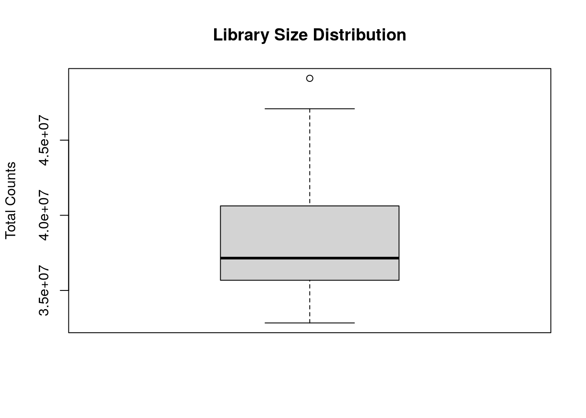
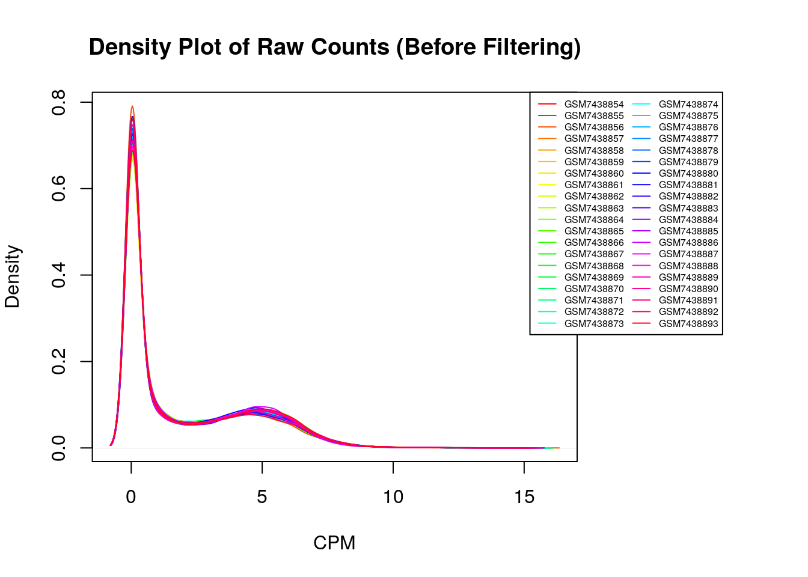
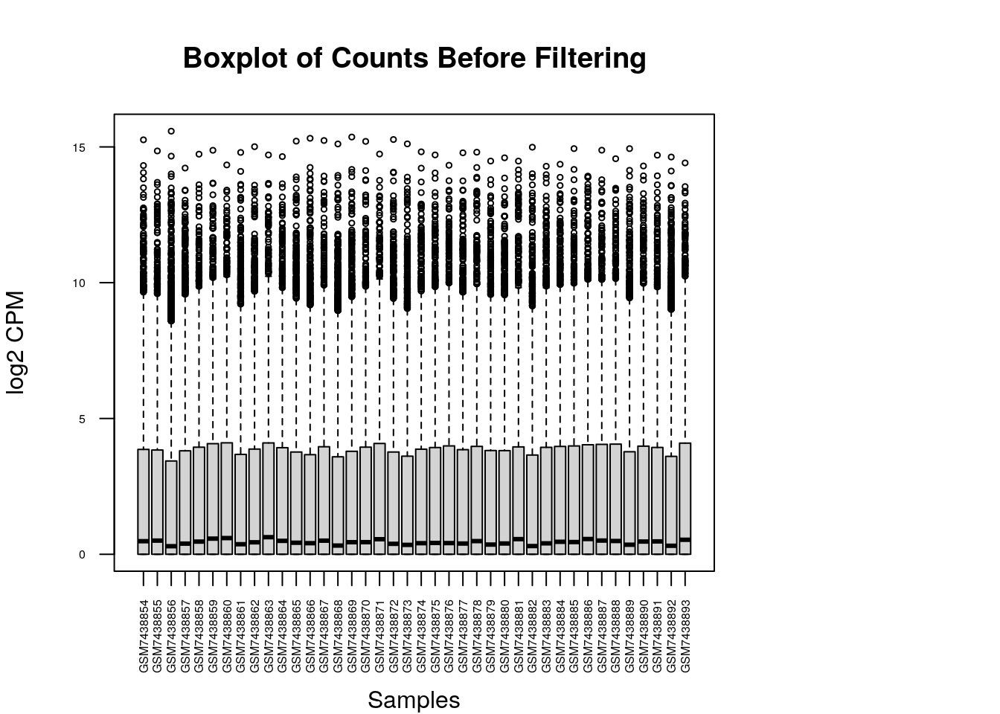
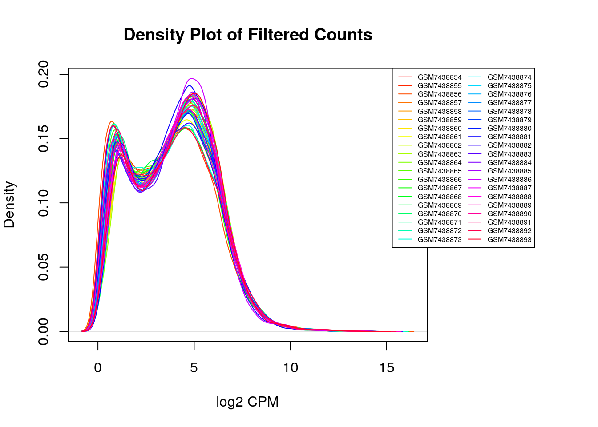
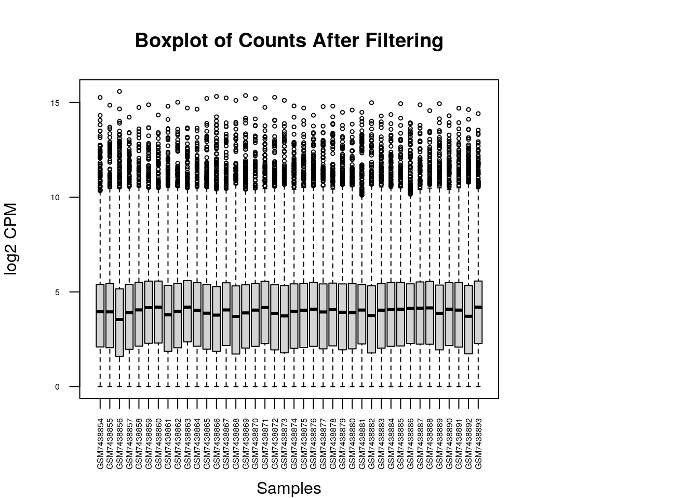
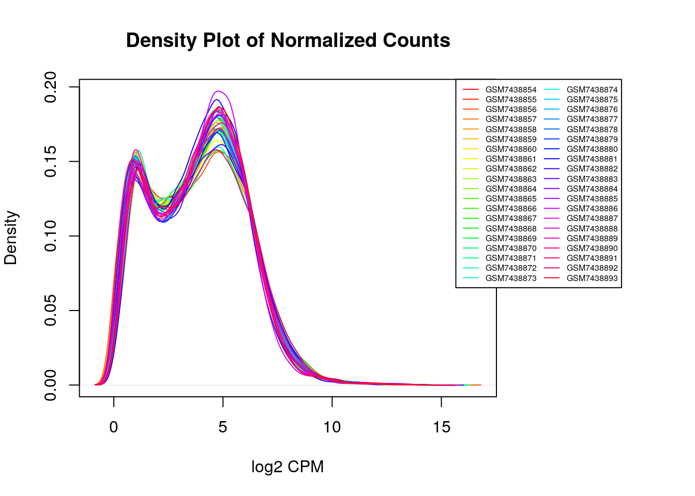
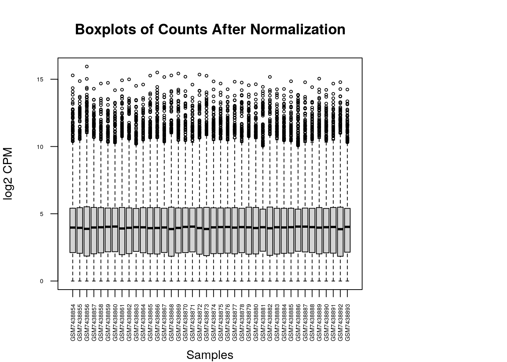
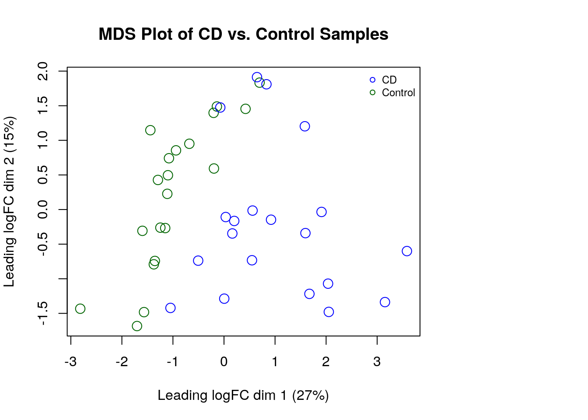
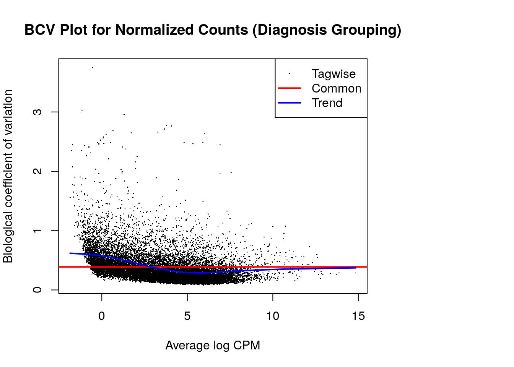
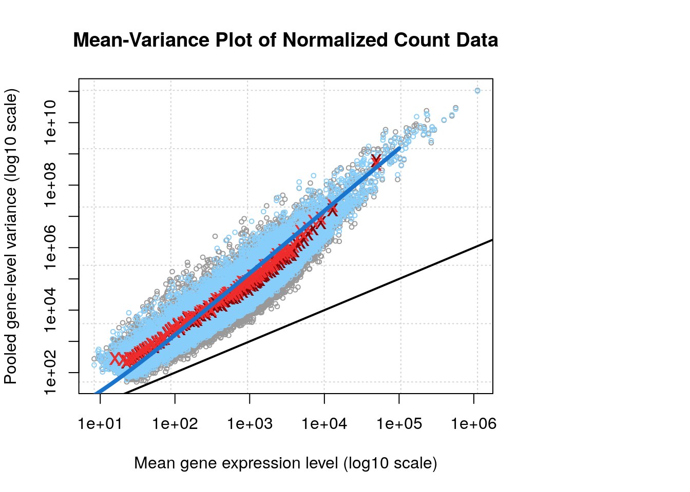

## Table of Contents
1. [Introduction](#introduction)
2. [Data Download](#data-download)
3. [Quality Assessment and Cleaning](#quality-assessment)
4. [Normalization](#normalization)
5. [Mapping to HUGO](#mapping-to-hugo)
6. [Interpretation & Questions](#interpretation--questions)

# Introduction

Crohn’s disease (CD) is a chronic inflammatory bowel disease (IBD) that affects the gastrointestinal tract, often leading to complications such as strictures, fistulas, and nutrient malabsorption [@kugathasan_2017a]. The global incidence of CD has risen sharply in recent decades [@coward_2024], particularly in urbanized regions, suggesting that environmental and dietary factors play a critical role in disease development and progression [@braun_2024; @coward_2024]. While genetic predisposition contributes to susceptibility [@kugathasan_2017a], increasing evidence highlights the impact of diet, microbiome alterations, and immune dysregulation in CD pathogenesis [@braun_2024; @coward_2024].

For this project, I sought to analyze transcriptomic data relevant to CD. To identify a suitable dataset, I searched the GEO database using the keywords “Crohn’s disease” while filtering for bulk RNA sequencing and human-derived samples. My goal was to explore how environmental exposures and diet might influence transcriptomic signatures in CD, building upon recent research linking urbanization, diet, and microbiome composition to immune and metabolic pathways associated with the disease [@braun_2024].

The dataset I selected, GSE233900, originates from the Diet-omics Study of Urban and Rural Crohn Disease Evolution (SOURCE) cohort, which examines the role of diet, microbiome, metabolomics, and transcriptomics in newly diagnosed CD patients and controls across rural and urban populations in China and Israel. This dataset is particularly compelling because it allows for the study of environmental influences on gut health, as rural-to-urban transitions appear to mirror changes seen in CD patients. By analyzing ileal transcriptomics, I aim to uncover differential gene expression patterns that may provide insight into the interaction between diet, microbial composition, and immune responses in CD [@braun_2024].

The dataset comprises 40 samples: 20 from Crohn’s disease patients and 20 from non-CD controls. RNA-seq was performed on ileal tissue biopsies from these individuals, providing a comprehensive snapshot of gene expression differences linked to disease status. For this report, I will conduct a differential expression analysis between Crohn’s and non-Crohn’s patients to identify key genes and pathways associated with CD pathogenesis, with a particular interest in genes linked to diet-microbiome interactions and immune regulation [@braun_2024].

For reference, I used GitHub Copilot for code completion. I used Copilot primarily for commenting, writing cat/print statements, and completing the latter half of lines of code. While I wrote the core logic, Copilot helped speed up the coding process. I attempted to use it for debugging at times; however, it was largely unhelpful.

# Data Download
Citations for the noted libraries are as follows: GEOquery [@davis_2007]; edgeR, [@yunshunchen_2017]; biomaRt [@smedley_2009], and dplyr [@wickham_2014].

``` r
# Load libraries
library("GEOquery")  # retreiving GEO data
library("edgeR")     # filtering, normalization
library("biomaRt")   # mapping gene IDs to HUGO symbols 
library(dplyr)

# In case for reproducibility
set.seed(2024)
```


``` r
gse_id <- "GSE233900"

gse <- getGEO(gse_id, GSEMatrix = FALSE)

# Print textual summary from GEO
gse@header$summary
```

```
## [1] "The Study Of Urban and Rural Crohn disease Evolution (SOURCE, n=380) characterized exposures, diet, and host and microbial factors in rural and urban Chinese controls and newly diagnosed Crohn Disease (CD), and in treatment-naïve Israeli CD and controls. We considered diet-omics domains simultaneously to detect complex interactions in the gut to prioritize potential beneficial and pathogenic factors."
```

``` r
# Extract list of GSM objects and count them
gsms_list <- gse@gsms
cat("Number of samples:", length(gsms_list), "\n")
```

```
## Number of samples: 40
```
The summary notes, "The Study Of Urban and Rural Crohn disease Evolution (SOURCE, n=380) characterized exposures, diet, and host and microbial factors in rural and urban Chinese controls and newly diagnosed Crohn Disease (CD), and in treatment-naïve Israeli CD and controls. We considered diet-omics domains simultaneously to detect complex interactions in the gut to prioritize potential beneficial and pathogenic factors."
[1] 40

After downloading the data, I must first inspect `sample_info` to see how the “CD vs. non-CD” status is encoded. 

``` r
# For each GSM object, we create a vector:
#   [ x@header$title, x@header$characteristics_ch1[1], x@header$characteristics_ch1[2], ... ]
# This will give each sample's annotation in separate columns rather than one long string.
sample_info <- do.call(
  rbind,
  lapply(gsms_list, function(x) {
    c(
      x@header$title,
      x@header$characteristics_ch1
    )
  })
)

# Convert to data frame
sample_info <- as.data.frame(sample_info)


colnames(sample_info) <- c(
  "title",         # e.g. "C487_TI2"
  "patient_id",    # e.g. "patient id: C487"
  "country",       # e.g. "country: China"
  "diagnosis",     # e.g. "diagosis: Control"
  "patient_group", # e.g. "patient group: Rural"
  "sex",           # e.g. "gender: female"
  "age",           # e.g. "age: 49"
  "bmi",           # e.g. "bmi: 20.44"
  "crp_mg_l"       # e.g. "crp mg_l: 2.67"
)

# Row names are the GSM IDs by default
head(sample_info)
```

```
##               title       patient_id        country         diagnosis        patient_group            sex     age        bmi
## GSM7438854 B206_TI2 patient id: B206 country: China diagosis: Control patient group: Urban   gender: male age: 38 bmi: 20.24
## GSM7438855 B207_TI2 patient id: B207 country: China diagosis: Control patient group: Urban   gender: male age: 52 bmi: 20.07
## GSM7438856 B209_TI2 patient id: B209 country: China diagosis: Control patient group: Urban gender: female age: 47 bmi: 21.48
## GSM7438857 B211_TI2 patient id: B211 country: China diagosis: Control patient group: Urban   gender: male age: 41 bmi: 12.63
## GSM7438858 B212_TI2 patient id: B212 country: China diagosis: Control patient group: Urban gender: female age: 31 bmi: 17.15
## GSM7438859 B223_TI2 patient id: B223 country: China diagosis: Control patient group: Urban gender: female age: 36 bmi: 18.36
##                  crp_mg_l
## GSM7438854 crp mg_l: 0.48
## GSM7438855  crp mg_l: 0.2
## GSM7438856 crp mg_l: 1.15
## GSM7438857  crp mg_l: 0.2
## GSM7438858  crp mg_l: 0.2
## GSM7438859 crp mg_l: 0.81
```

``` r
#Minimal Control vs Non-Control Example

# rowname; title; desc
# GSM7438873 C487_TI2 patient id: C487; country: China; diagosis: Control; patient group: Rural; gender: female; age: 49; bmi: 20.44; crp mg_l: 2.67
# GSM7438874 D605_TI1           patient id: D605; country: China; diagosis: CD; patient group: CD; gender: male; age: 29; bmi: 20.31; crp mg_l: 4.65
```

We can print out the dataframe as the following:

``` r
sample_info
```

```
##               title       patient_id        country         diagnosis        patient_group            sex     age        bmi
## GSM7438854 B206_TI2 patient id: B206 country: China diagosis: Control patient group: Urban   gender: male age: 38 bmi: 20.24
## GSM7438855 B207_TI2 patient id: B207 country: China diagosis: Control patient group: Urban   gender: male age: 52 bmi: 20.07
## GSM7438856 B209_TI2 patient id: B209 country: China diagosis: Control patient group: Urban gender: female age: 47 bmi: 21.48
## GSM7438857 B211_TI2 patient id: B211 country: China diagosis: Control patient group: Urban   gender: male age: 41 bmi: 12.63
## GSM7438858 B212_TI2 patient id: B212 country: China diagosis: Control patient group: Urban gender: female age: 31 bmi: 17.15
## GSM7438859 B223_TI2 patient id: B223 country: China diagosis: Control patient group: Urban gender: female age: 36 bmi: 18.36
## GSM7438860 B226_TI2 patient id: B226 country: China diagosis: Control patient group: Urban gender: female age: 38 bmi: 19.53
## GSM7438861 B228_TI2 patient id: B228 country: China diagosis: Control patient group: Urban gender: female age: 48 bmi: 21.37
## GSM7438862 B230_TI2 patient id: B230 country: China diagosis: Control patient group: Urban gender: female age: 36 bmi: 19.07
## GSM7438863 B231_TI2 patient id: B231 country: China diagosis: Control patient group: Urban gender: female age: 27 bmi: 21.26
## GSM7438864 B232_TI2 patient id: B232 country: China diagosis: Control patient group: Urban gender: female age: 38 bmi: 18.73
## GSM7438865 B235_TI2 patient id: B235 country: China diagosis: Control patient group: Urban   gender: male age: 48 bmi: 24.22
## GSM7438866 B236_TI2 patient id: B236 country: China diagosis: Control patient group: Urban gender: female age: 38 bmi: 21.22
## GSM7438867 B238_TI2 patient id: B238 country: China diagosis: Control patient group: Urban   gender: male age: 41 bmi: 25.25
## GSM7438868 B319_TI2 patient id: B319 country: China diagosis: Control patient group: Urban   gender: male age: 25 bmi: 22.55
## GSM7438869 B320_TI2 patient id: B320 country: China diagosis: Control patient group: Urban gender: female age: 27 bmi: 19.53
## GSM7438870 B321_TI2 patient id: B321 country: China diagosis: Control patient group: Urban   gender: male age: 28 bmi: 20.28
## GSM7438871 B322_TI2 patient id: B322 country: China diagosis: Control patient group: Urban   gender: male age: 27 bmi: 21.97
## GSM7438872 B323_TI2 patient id: B323 country: China diagosis: Control patient group: Urban   gender: male age: 32 bmi: 21.96
## GSM7438873 C487_TI2 patient id: C487 country: China diagosis: Control patient group: Rural gender: female age: 49 bmi: 20.44
## GSM7438874 D605_TI1 patient id: D605 country: China      diagosis: CD    patient group: CD   gender: male age: 29 bmi: 20.31
## GSM7438875 D606_TI1 patient id: D606 country: China      diagosis: CD    patient group: CD gender: female age: 53 bmi: 17.31
## GSM7438876 D607_TI1 patient id: D607 country: China      diagosis: CD    patient group: CD gender: female age: 25  bmi: 16.3
## GSM7438877 D611_TI1 patient id: D611 country: China      diagosis: CD    patient group: CD   gender: male age: 28 bmi: 19.95
## GSM7438878 D612_TI1 patient id: D612 country: China      diagosis: CD    patient group: CD   gender: male age: 44  bmi: 21.8
## GSM7438879 D614_TI1 patient id: D614 country: China      diagosis: CD    patient group: CD gender: female age: 25 bmi: 18.07
## GSM7438880 D618_TI2 patient id: D618 country: China      diagosis: CD    patient group: CD gender: female age: 27 bmi: 16.19
## GSM7438881 D621_TI2 patient id: D621 country: China      diagosis: CD    patient group: CD   gender: male age: 35 bmi: 15.92
## GSM7438882 D627_TI1 patient id: D627 country: China      diagosis: CD    patient group: CD gender: female age: 30 bmi: 15.23
## GSM7438883 D629_TI1 patient id: D629 country: China      diagosis: CD    patient group: CD   gender: male age: 38 bmi: 18.36
## GSM7438884 D632_TI1 patient id: D632 country: China      diagosis: CD    patient group: CD   gender: male age: 28  bmi: 20.2
## GSM7438885 D633_TI1 patient id: D633 country: China      diagosis: CD    patient group: CD gender: female age: 39 bmi: 23.07
## GSM7438886 D648_TI2 patient id: D648 country: China      diagosis: CD    patient group: CD gender: female age: 33 bmi: 16.62
## GSM7438887 D678_TI1 patient id: D678 country: China      diagosis: CD    patient group: CD   gender: male age: 29 bmi: 19.04
## GSM7438888 D680_TI2 patient id: D680 country: China      diagosis: CD    patient group: CD   gender: male age: 34 bmi: 16.46
## GSM7438889 D681_TI1 patient id: D681 country: China      diagosis: CD    patient group: CD gender: female age: 41 bmi: 24.78
## GSM7438890 D683_TI1 patient id: D683 country: China      diagosis: CD    patient group: CD gender: female age: 27 bmi: 16.59
## GSM7438891 D685_TI2 patient id: D685 country: China      diagosis: CD    patient group: CD gender: female age: 31 bmi: 20.83
## GSM7438892 D686_TI1 patient id: D686 country: China      diagosis: CD    patient group: CD   gender: male age: 28  bmi: 16.9
## GSM7438893 D687_TI2 patient id: D687 country: China      diagosis: CD    patient group: CD   gender: male age: 30 bmi: 19.02
##                  crp_mg_l
## GSM7438854 crp mg_l: 0.48
## GSM7438855  crp mg_l: 0.2
## GSM7438856 crp mg_l: 1.15
## GSM7438857  crp mg_l: 0.2
## GSM7438858  crp mg_l: 0.2
## GSM7438859 crp mg_l: 0.81
## GSM7438860  crp mg_l: 0.2
## GSM7438861 crp mg_l: 0.37
## GSM7438862  crp mg_l: 0.2
## GSM7438863 crp mg_l: 0.36
## GSM7438864 crp mg_l: 0.48
## GSM7438865    crp mg_l: 1
## GSM7438866 crp mg_l: 0.26
## GSM7438867 crp mg_l: 0.29
## GSM7438868  crp mg_l: 0.2
## GSM7438869  crp mg_l: 0.2
## GSM7438870  crp mg_l: 0.2
## GSM7438871  crp mg_l: 0.2
## GSM7438872  crp mg_l: 0.2
## GSM7438873 crp mg_l: 2.67
## GSM7438874 crp mg_l: 4.65
## GSM7438875 crp mg_l: 2.88
## GSM7438876 crp mg_l: 1.88
## GSM7438877 crp mg_l: 3.74
## GSM7438878 crp mg_l: 30.4
## GSM7438879 crp mg_l: 15.8
## GSM7438880 crp mg_l: 5.54
## GSM7438881 crp mg_l: 46.3
## GSM7438882 crp mg_l: 0.78
## GSM7438883 crp mg_l: 33.1
## GSM7438884 crp mg_l: 29.4
## GSM7438885 crp mg_l: 4.21
## GSM7438886 crp mg_l: 0.78
## GSM7438887 crp mg_l: 0.78
## GSM7438888 crp mg_l: 8.36
## GSM7438889 crp mg_l: 9.01
## GSM7438890 crp mg_l: 3.94
## GSM7438891   crp mg_l: 39
## GSM7438892 crp mg_l: 35.9
## GSM7438893 crp mg_l: 0.78
```


The sample_info dataframe notes how control and non-control patients are encoded. This will be used for the quality assessment and general pre-normalization steps in the next section. We will be using all 40 samples (20 Crohn’s, 20 non-Crohn’s) to increase statistical power and better captures biological variability within each group.


#Quality Assessment and Cleaning

First, I start by extracting only the attributes I am interested in. The methods from this code block is nearly identical to the code from lecture 4[@isserlin_2025]. 

``` r
sample_info <- sample_info[, c("diagnosis", "patient_group", "sex", "age")]

# Remove text prefixes (adjust these patterns if necessary)
sample_info$diagnosis     <- gsub("diagosis: ", "", sample_info$diagnosis)
sample_info$patient_group <- gsub("patient group: ", "", sample_info$patient_group)
sample_info$sex           <- gsub("gender: ", "", sample_info$sex)
sample_info$age           <- gsub("age: ", "", sample_info$age)

# Double checking each row only contains CD or Control
sample_info <- sample_info[sample_info$diagnosis %in% c("CD", "Control"), ]
```


The supplemental file retrieved from getGEOSuppFiles, GSE233900_RAW.tar, only contained TPM data. As such, to download the raw counts for normalization analysis I fetched the count data directly from the NCBI website instead. The count url was derived by going to https://www.ncbi.nlm.nih.gov/geo/download/?acc=GSE233900 and copying the hyperlink attached to GSE233900_raw_counts_GRCh38.p13_NCBI.tsv.gz.

``` r
# Downloading supplemental files into GSE233900/GSE233900_RAW.tar
# getGEOSuppFiles(gse_id, fetch_files = TRUE)

raw_counts_url <- "https://www.ncbi.nlm.nih.gov/geo/download/?type=rnaseq_counts&acc=GSE233900&format=file&file=GSE233900_raw_counts_GRCh38.p13_NCBI.tsv.gz"

# Download the file (uncomment and adjust if needed)
download.file(raw_counts_url, destfile = "GSE233900_raw_counts_GRCh38.p13_NCBI.tsv.gz")

# Read the raw count data into R
raw_counts <- read.table(gzfile("GSE233900_raw_counts_GRCh38.p13_NCBI.tsv.gz"), 
                         header = TRUE, sep = "\t", stringsAsFactors = FALSE)

head(raw_counts)
```

```
##      GeneID GSM7438854 GSM7438855 GSM7438856 GSM7438857 GSM7438858 GSM7438859 GSM7438860 GSM7438861 GSM7438862 GSM7438863 GSM7438864
## 1 100287102          3          2          4          4          2          7          3          3          0          7          2
## 2    653635       1262       1424        798       1150       1137       1296        863        693        599       1299        768
## 3 102466751         48         61         10         25         45         49         40         18         17         76         35
## 4 107985730          0          0          0          0          0          0          1          0          0          2          1
## 5 100302278          0          0          0          0          0          0          0          0          0          0          0
## 6    645520          3          0          1          0          1          1          0         13          0          0          0
##   GSM7438865 GSM7438866 GSM7438867 GSM7438868 GSM7438869 GSM7438870 GSM7438871 GSM7438872 GSM7438873 GSM7438874 GSM7438875
## 1          4          6          2          1          3          2          4          0          2          1          2
## 2        915        704        845        683        920        656       1012        518        716        554        675
## 3         31         16         34         12         46         14         41         21         25         17         16
## 4          0          0          0          0          0          0          1          0          0          0          0
## 5          0          0          0          0          0          0          0          0          0          0          0
## 6          0          0          2          0          1          1          0          1          0          0          0
##   GSM7438876 GSM7438877 GSM7438878 GSM7438879 GSM7438880 GSM7438881 GSM7438882 GSM7438883 GSM7438884 GSM7438885 GSM7438886
## 1          3          3          1          4          3          4          2          3          5          2          1
## 2        634        445        699        414        682       1289        547        726        753       1110       1335
## 3         17         10         20         17         16        106         13         13         31         38         29
## 4          0          1          2          0          0          1          1          1          0          1          0
## 5          0          1          0          0          0          0          0          0          0          0          0
## 6          0          3          1          0          0          0          1          0          0          1          0
##   GSM7438887 GSM7438888 GSM7438889 GSM7438890 GSM7438891 GSM7438892 GSM7438893
## 1          0          4          2          3          1          3          1
## 2        481        667        637        842        653        702        503
## 3         16         17         17         17         19         28         11
## 4          1          0          0          0          0          0          0
## 5          0          1          0          0          0          0          0
## 6          0          3          0          0          1          0          0
```

The column names in the count matrix correspond exactly with the GSM IDs in sample_info.

Now we can filter out genes with low expression. First we must prepare the count matrix.

``` r
# If the first column contains gene IDs, set them as row names and remove that column
rownames(raw_counts) <- raw_counts[,1]
raw_counts <- raw_counts[, -1]

# Check the dimensions and structure
dim(raw_counts)
```

```
## [1] 39376    40
```

``` r
str(raw_counts)
```

```
## 'data.frame':	39376 obs. of  40 variables:
##  $ GSM7438854: int  3 1262 48 0 0 3 0 72 466 5 ...
##  $ GSM7438855: int  2 1424 61 0 0 0 0 44 207 2 ...
##  $ GSM7438856: int  4 798 10 0 0 1 0 16 63 0 ...
##  $ GSM7438857: int  4 1150 25 0 0 0 0 36 106 1 ...
##  $ GSM7438858: int  2 1137 45 0 0 1 0 63 277 0 ...
##  $ GSM7438859: int  7 1296 49 0 0 1 0 62 208 1 ...
##  $ GSM7438860: int  3 863 40 1 0 0 0 135 165 0 ...
##  $ GSM7438861: int  3 693 18 0 0 13 0 16 308 0 ...
##  $ GSM7438862: int  0 599 17 0 0 0 0 31 100 1 ...
##  $ GSM7438863: int  7 1299 76 2 0 0 0 18 207 1 ...
##  $ GSM7438864: int  2 768 35 1 0 0 0 46 266 0 ...
##  $ GSM7438865: int  4 915 31 0 0 0 1 64 166 2 ...
##  $ GSM7438866: int  6 704 16 0 0 0 2 24 93 0 ...
##  $ GSM7438867: int  2 845 34 0 0 2 0 41 151 3 ...
##  $ GSM7438868: int  1 683 12 0 0 0 0 19 93 0 ...
##  $ GSM7438869: int  3 920 46 0 0 1 0 45 181 2 ...
##  $ GSM7438870: int  2 656 14 0 0 1 0 48 205 1 ...
##  $ GSM7438871: int  4 1012 41 1 0 0 0 80 390 2 ...
##  $ GSM7438872: int  0 518 21 0 0 1 0 42 187 0 ...
##  $ GSM7438873: int  2 716 25 0 0 0 0 24 140 2 ...
##  $ GSM7438874: int  1 554 17 0 0 0 0 29 120 1 ...
##  $ GSM7438875: int  2 675 16 0 0 0 0 21 199 0 ...
##  $ GSM7438876: int  3 634 17 0 0 0 0 19 430 0 ...
##  $ GSM7438877: int  3 445 10 1 1 3 0 24 107 0 ...
##  $ GSM7438878: int  1 699 20 2 0 1 0 79 329 0 ...
##  $ GSM7438879: int  4 414 17 0 0 0 0 29 265 3 ...
##  $ GSM7438880: int  3 682 16 0 0 0 0 25 253 8 ...
##  $ GSM7438881: int  4 1289 106 1 0 0 0 48 428 2 ...
##  $ GSM7438882: int  2 547 13 1 0 1 0 11 97 5 ...
##  $ GSM7438883: int  3 726 13 1 0 0 0 51 529 0 ...
##  $ GSM7438884: int  5 753 31 0 0 0 0 36 1113 0 ...
##  $ GSM7438885: int  2 1110 38 1 0 1 0 20 334 1 ...
##  $ GSM7438886: int  1 1335 29 0 0 0 0 42 484 0 ...
##  $ GSM7438887: int  0 481 16 1 0 0 0 25 67 0 ...
##  $ GSM7438888: int  4 667 17 0 1 3 1 55 249 7 ...
##  $ GSM7438889: int  2 637 17 0 0 0 0 18 263 10 ...
##  $ GSM7438890: int  3 842 17 0 0 0 0 38 603 1 ...
##  $ GSM7438891: int  1 653 19 0 0 1 0 34 221 0 ...
##  $ GSM7438892: int  3 702 28 0 0 0 0 19 163 1 ...
##  $ GSM7438893: int  1 503 11 0 0 0 0 40 225 1 ...
```

``` r
# Convert raw_counts to a numeric matrix
raw_counts_matrix <- as.matrix(raw_counts)
mode(raw_counts_matrix) <- "numeric"
```

To examine the quality of the data, and whether it is suitable for this assignment, we can note the differences in the data before and after filtering.

``` r
library_sizes <- colSums(raw_counts_matrix)
boxplot(library_sizes, main = "Library Size Distribution", ylab = "Total Counts")
```



``` r
plot_densities_by_sample <- function(dat, xlab, ylab, main) {
  densities_by_sample <- apply(log2(dat + 1), 2, density)
  x_lim <- range(sapply(densities_by_sample, function(x) x$x))
  y_lim <- range(sapply(densities_by_sample, function(x) x$y))
  cols <- rainbow(ncol(dat))
  
  par(mar = c(5, 4, 4, 10))  # Increase right margin space
  plot(densities_by_sample[[1]], xlim = x_lim, ylim = y_lim, 
       type = "n", xlab = xlab, ylab = ylab, main = main)
  for (i in 1:length(densities_by_sample)) {
    lines(densities_by_sample[[i]], col = cols[i])
  }
  
  # Adding legend outside the density plot
  legend("topright", inset = c(-0.3, 0), legend = colnames(dat), 
         col = cols, lty = 1, cex = 0.5, ncol = 2, xpd = TRUE)
}

plot_densities_by_sample(cpm(raw_counts_matrix), 
                         xlab = "CPM", 
                         ylab = "Density", 
                         main = "Density Plot of Raw Counts (Before Filtering)")
```



``` r
boxplot(log2(cpm(raw_counts_matrix) + 1), xlab = "", ylab = "log2 CPM",
        las = 2, cex = 0.5, cex.lab = 1, cex.axis = 0.5, 
        main = "Boxplot of Counts Before Filtering")

mtext("Samples", side = 1, line = 4)
```


To analyze the quality of the data before filtering, I plotted a box plot for library size, a density plot of the raw counts, and a box plot of the counts.

The total counts per sample appear relatively uniform, with one  outlier. Since there are no extreme variations, there is likely no major technical issues with sequencing depth. Since the one outlier is only slightly outside of the whiskers, it does not immediately suggest a technical artifact or to remove the sample. If one sample clusters separately in later analysis, and it is this sample, this might more of a consideration. 

The boxplot shows the log2-transformed CPM values across samples. The distribution appears consistent across samples, indicating no major batch effects and while there are some outliers (dots above the whiskers), given the volume of the RNA-seq data, a seemingly large number of outliers is expected before filtering. The median expression levels are comparable across samples which means the data is well distributed.

The density plot shows a bimodal distribution, which is typical for RNA-seq data. I expect that peak near 0 CPM corresponds to lowly expressed genes, which should be filtered, and the other noting moderately to highly expressed genes in the dataset. The curves are overlapping, indicating no major discrepancies between samples. This suggests that all samples were processed under similar conditions, potentially making differential expression analysis more reliable. 

The plots suggest that the experimental conditions for creating the data were high quality.

Now, we can filter out lowly expressed genes. By modifying the procedure from lecture[@isserlin_2025], we aim to keep genes with at least 1 CPM in at least a certain number of samples. While 4 samples may be a low number, after later analysis of HUGO symbols there were a relatively low number of genes remaining. Hence, the threshold was decreased to 4 temporarily from 9.

``` r
# Calculating CPM values and filtering genes
# Keeping genes with at least 1 CPM in at least 4 samples
keep_genes <- rowSums(cpm(raw_counts_matrix) > 1) >= 4
filtered_counts <- raw_counts_matrix[keep_genes, ]
```

Now we want to examine the effects of the filtering by modifying the code from lecture [@isserlin_2025] for density plots.

``` r
# Examining Dimensions
cat("Dimensions before filtering:", dim(raw_counts_matrix), "\n")
```

```
## Dimensions before filtering: 39376 40
```

``` r
cat("Dimensions after filtering:", dim(filtered_counts), "\n")
```

```
## Dimensions after filtering: 19118 40
```

``` r
# Count how many genes have zero counts across all samples
zero_count_genes <- sum(rowSums(raw_counts_matrix) == 0)

# Count how many genes have low expression (less than 1 CPM in all samples)
low_expressed_genes <- sum(rowSums(cpm(raw_counts_matrix) > 1) < 1)

cat("Total genes before filtering:", nrow(raw_counts_matrix), "\n")
```

```
## Total genes before filtering: 39376
```

``` r
cat("Genes with zero counts in all samples before:", zero_count_genes, "\n")
```

```
## Genes with zero counts in all samples before: 4531
```

``` r
cat("Genes with very low expression (CPM < 1 in all samples):", low_expressed_genes, "\n")
```

```
## Genes with very low expression (CPM < 1 in all samples): 18752
```

``` r
plot_densities_by_sample(cpm(filtered_counts), 
                         xlab = "log2 CPM", 
                         ylab = "Density", 
                         main = "Density Plot of Filtered Counts")
```



``` r
boxplot(log2(cpm(filtered_counts) + 1), xlab = "", ylab = "log2 CPM",
        las = 2, cex = 0.5, cex.lab = 1, cex.axis = 0.5, 
        main = "Boxplot of Counts After Filtering")

mtext("Samples", side = 1, line = 4)
```


Before filtering there were 39376 genes, after filtering there are now 19118 genes. Compared to the unfiltered density plot, the increase in the second peak suggests that lowly expressed genes have been removed largely successfully. The box plot of counts after filtering notes almost no changes which is expected, some changes to the median of each sample is expected after normalization [@isserlin_2025].

Dimensions before filtering: 39376 40 
Dimensions after filtering: 19118 40 
Total genes before filtering: 39376 
Genes with zero counts in all samples: 4531 
Genes with very low expression (CPM < 1 in all samples): 18752 


# Normalization

After deciding on the data set, we can construct an edgeR DGEList object using the filtered count matrix and define groupings for CD vs control. Afterwards, we calculate normalization factors using the TMM method, as noted in class [@isserlin_2025].

``` r
group <- factor(sample_info$diagnosis)

dge <- DGEList(counts = filtered_counts, group = group)
# dge$samples

# TMM normalization factors
dge <- calcNormFactors(dge)

dge$samples
```

```
##              group lib.size norm.factors
## GSM7438854 Control 42809205    0.9833906
## GSM7438855 Control 35872020    0.9936956
## GSM7438856 Control 39392650    0.7757595
## GSM7438857 Control 41538324    0.9512746
## GSM7438858 Control 36591080    1.0387054
## GSM7438859 Control 34546071    1.1073428
## GSM7438860 Control 37000599    1.1121027
## GSM7438861 Control 37675989    0.9189967
## GSM7438862 Control 36322897    1.0131960
## GSM7438863 Control 34608807    1.1476743
## GSM7438864 Control 39093180    1.0271733
## GSM7438865 Control 34966590    0.9606921
## GSM7438866 Control 33545982    0.8797735
## GSM7438867 Control 38471953    1.0503902
## GSM7438868 Control 36198026    0.8864915
## GSM7438869 Control 38708387    0.9589699
## GSM7438870 Control 35725986    1.0114900
## GSM7438871 Control 42559353    1.1007576
## GSM7438872 Control 49051172    0.9493766
## GSM7438873 Control 36893849    0.9051626
## GSM7438874      CD 36644844    0.9863195
## GSM7438875      CD 32796139    1.0173957
## GSM7438876      CD 36276584    1.0508124
## GSM7438877      CD 37908302    0.9779505
## GSM7438878      CD 34918421    1.0397322
## GSM7438879      CD 35539329    0.9512051
## GSM7438880      CD 40953499    0.9811044
## GSM7438881      CD 40198879    1.0315713
## GSM7438882      CD 47041880    0.8815934
## GSM7438883      CD 43354538    1.0266590
## GSM7438884      CD 42567199    1.0619410
## GSM7438885      CD 40914674    1.0638992
## GSM7438886      CD 35706430    1.0596916
## GSM7438887      CD 33288861    1.0748282
## GSM7438888      CD 37168992    1.1143587
## GSM7438889      CD 46904222    0.9291442
## GSM7438890      CD 39027470    1.0650600
## GSM7438891      CD 38473119    1.0153467
## GSM7438892      CD 32831743    0.8985096
## GSM7438893      CD 33416022    1.1308419
```

``` r
norm_cpm <- cpm(dge)
```

To observe how the distribution of the data changed, we can plot the data after normalization.

``` r
log_normalized_cpm <- log2(norm_cpm + 1) # +1 for no log of 0


# Density plot 
plot_densities_by_sample(norm_cpm, 
                         xlab = "log2 CPM", 
                         ylab = "Density", 
                         main = "Density Plot of Normalized Counts")
```



``` r
# Boxplot: Distribution of Samples After Normalization
boxplot(log2(norm_cpm + 1), xlab = "", ylab = "log2 CPM",
        las = 2, cex = 0.5, cex.lab = 1, cex.axis = 0.5, 
        main = "Boxplots of Counts After Normalization")
mtext("Samples", side = 1, line = 4)
```



``` r
# MDS Plot: Checking Sample Clustering
limma::plotMDS(dge, labels = NULL, 
               main = "MDS Plot of CD vs. Control Samples",
               pch = 1, cex = 1.5, 
               col = c("blue", "darkgreen")[factor(sample_info$diagnosis)])
legend("topright", legend = levels(factor(sample_info$diagnosis)), 
       pch = 1, col = c("blue", "darkgreen"), bty = "n", cex = 0.75)
```



``` r
# BCV Plot: Dispersion Estimation
dge <- estimateDisp(dge, model.matrix(~ factor(sample_info$diagnosis)))
plotBCV(dge, col.tagwise = "black", col.common = "red", 
               main = "BCV Plot for Normalized Counts (Diagnosis Grouping)")
```



``` r
# Mean-Variance Plot: Checking Negative Binomial Assumption
plotMeanVar(dge, show.raw.vars = TRUE, 
                   show.tagwise.vars = TRUE, NBline = TRUE, 
                   show.ave.raw.vars = TRUE, 
                   show.binned.common.disp.vars = TRUE,
                   main = "Mean-Variance Plot of Normalized Count Data")
```

```
## Warning in plot.window(...): "plot.first" is not a graphical parameter
```

```
## Warning in plot.xy(xy, type, ...): "plot.first" is not a graphical parameter
```

```
## Warning in axis(side = side, at = at, labels = labels, ...): "plot.first" is not a graphical parameter
## Warning in axis(side = side, at = at, labels = labels, ...): "plot.first" is not a graphical parameter
```

```
## Warning in box(...): "plot.first" is not a graphical parameter
```

```
## Warning in title(...): "plot.first" is not a graphical parameter
```


Density plot: The density plot looks largely the same shape as the filtered counts graph before normalization. This is good since it suggests again that there are few technical problems or artifacts.

Box plot: The medians of each sample appear slightly closer together after TMM normalization than the original, as expected [@isserlin_2025]. Otherwise, not too many changes.

MDS plot: Visualizing the similarity between samples based on their gene expression profiles, CD (Crohn’s Disease) samples (blue) and Control samples (green) form distinct clusters, indicating clear separation in gene expression patterns between conditions. The first dimension (x-axis) explains 27% of the variation, while the second (y-axis) explains 15%, meaning most of the group separation is along the x-axis. Some overlap exists, but overall, the separation suggests that differential expression analysis should yield biologically meaningful results.

BCV plot: The shape of the BCV plot suggests that genes with low expression levels have higher variability, while genes with high expression levels have lower variability. This is to be expected of quality data [@isserlin_2025]. The trend line (blue) follows a decreasing pattern as expression levels increase, which is expected in properly processed RNA-seq data. The common dispersion (red line) remains relatively stable, providing an overall estimate of variability across genes.


# Mapping to HUGO

Setting up biomaRt. The dataset used in lecture, hsapiens_gene_ensembl, is used here [@isserlin_2025]. Throughout the duration of this assignment, there have been server side biomaRt issues. If "! Your query has been redirected to http://status.ensembl.org indicating this Ensembl service is currently unavailable." occurs, rerun the block at a later time and it should function.

``` r
ensembl <- useMart("ensembl")
```

```
## Error: Your query has been redirected to http://status.ensembl.org indicating this Ensembl service is currently unavailable.
## Look at ?useEnsembl for details on how to try a mirror site.
```

This code has been separated from the code above since the BioMart connection is unstable at times. Re-running this code block multiple times works on my 2021 Apple M1 Pro, in the worst cases I have only had to re-run the block 4 times. I have had more success after installing the latest version of biomaRt; however, it is not necessary.

``` r
# Uncomment to download latest version of biomaRt
# BiocManager::install("biomaRt") 

# Uncomment to use different mirror
# ensembl_human <- useEnsembl(biomart = "genes", dataset = "hsapiens_gene_ensembl", mirror = "uswest")


ensembl_human <- useDataset("hsapiens_gene_ensembl", mart = ensembl)
```

```
## Error in checkDataset(dataset = dataset, mart = mart): The given dataset:  hsapiens_gene_ensembl , is not valid.  Correct dataset names can be obtained with the listDatasets() function.
```


Next, we must retrieve a list of available filters in the Ensembl BioMart database, extract filters related to Entrez Gene IDs, and search for attributes related to Entrez and HGNC symbols to ensure they are available for gene ID mapping.

``` r
# Listing available filters to verify the Entrez filter
biomart_human_filters <- listFilters(ensembl_human)
entrez_filters <- biomart_human_filters[grep("entrez", biomart_human_filters$name),]


# Searching for attributes related to Entrez and HGNC
entrez_attributes <- searchAttributes(mart = ensembl_human, pattern = "entrez")
hgnc_attributes <- searchAttributes(mart = ensembl_human, pattern = "hgnc")


# entrez_attributes 
# hgnc_attributes
```
The attributes we are interested in are "entrezgene_id" and "hgnc_symbol" since they allow us to map the NCBI entrez identifiers to HUGO symbols.

Similar to the biomaRt connection problems, id_conversion may error noting "HTTP 405 Method Not Allowed". Despite the error suggesting there is a request issue, it appears to be a biomaRt server side issue. Re-running the code block multiple times works similar to above, worst recorded case required rerunning 3 times. The latest version of biomaRt is less prone to this error; however, it is not necessary. This code is a modified variation of lecture material [@isserlin_2025].


Next, we retrieve HGNC symbols for a list of Entrez Gene IDs extracted from the row names of norm_cpm using the Ensembl BioMart database.

``` r
# BiocManager::install("biomaRt")

ids_to_convert <- rownames(norm_cpm)

id_conversion <- getBM(attributes = c("entrezgene_id", "hgnc_symbol"),
                       filters = "entrezgene_id",
                       values = ids_to_convert,
                       mart = ensembl_human)
```


Then, we merge the Entrez-to-HGNC mapping (id_conversion) with the normalized gene expression data (norm_cpm), matching on Entrez Gene IDs, and keep all rows from norm_cpm.

``` r
# Merge the mapping with normalized counts.
norm_cpm_annot <- merge(id_conversion, 
                                 norm_cpm, 
                                 by.x = "entrezgene_id", 
                                 by.y = 0, 
                                 all.y = TRUE)

head(norm_cpm_annot)
```

```
##   entrezgene_id hgnc_symbol GSM7438854 GSM7438855 GSM7438856 GSM7438857 GSM7438858 GSM7438859 GSM7438860 GSM7438861 GSM7438862
## 1             1        A1BG   2.019090   1.767386   2.257911   1.796816   1.341846   2.666364   3.766848   1.415199   1.222753
## 2            10        NAT2  21.354848  27.268239  38.580826  30.469942  22.890308  21.540039  20.681208  30.903322  24.753946
## 3           100         ADA   5.534682   9.566326   3.435951   6.984804   7.103889   6.953459   9.818106   6.238428   6.765897
## 4          1000        CDH2   2.114106   1.009935   2.486974   1.569050   2.157477   2.326533   3.280803   1.328554   2.690056
## 5         10000        AKT3  13.706059   9.566326  11.453171  10.730279  15.996905  20.389842  16.404013  11.899223  16.140334
## 6     100008587   RNA5-8SN5   4.180704   5.779071   2.912378   2.353575   1.604953   1.882139   2.357317   2.426055   1.005374
##   GSM7438863 GSM7438864 GSM7438865 GSM7438866 GSM7438867 GSM7438868 GSM7438869 GSM7438870 GSM7438871 GSM7438872 GSM7438873
## 1   3.096705   1.967353  1.1014486   1.761943   1.484760  0.8102404   1.427795  1.3836435   3.329951  1.2884375  1.4972332
## 2  12.084703  24.903206 29.3818855  31.003429  22.741579 27.5481722  20.878132 18.9282424  14.109602 22.8053434 27.9982606
## 3  15.156231   8.940251  4.5248699   5.827967   6.235993  3.9577125   4.741356  8.5232437  10.416771  4.2088958  3.8928063
## 4   3.046352   2.141676  0.8037598   2.168546   1.633236  0.7790773   1.427795  2.4075396   2.155930  3.0493020  1.3475099
## 5  22.658817  13.871086 14.1699873  17.009531  18.435774 12.5898887  13.173428 24.1307418  21.388534 15.4397758  9.3427351
## 6   4.934587   2.266192  2.0242839   1.389225   3.068505  1.3088498   1.831888  0.9408775   1.067292  0.4724271  0.7186719
##   GSM7438874 GSM7438875 GSM7438876 GSM7438877 GSM7438878 GSM7438879 GSM7438880 GSM7438881 GSM7438882 GSM7438883 GSM7438884
## 1  1.2173688  1.9780230  2.5708367  1.0250201  2.0382414  2.3073380  1.7919516   3.327867  0.8198340   1.392935   2.234323
## 2 20.8059400 16.7232851 13.8248055 23.7103328 21.0159216 21.1505985 29.7911950  11.623418 27.2233117  14.401153  10.751296
## 3  8.5769168  9.9200849 14.2707670  7.3100116 14.5982155 16.4471787  6.2718305  10.224749  4.4608615  15.704221  18.073680
## 4  2.7114124  1.6783225  2.4921376  2.0770144  1.2394711  2.5735693  1.6426223   2.676762  2.5077276   2.111869   1.592785
## 5 15.1617754 14.8351723 21.2225193 16.4542696 15.1215478 19.1686543 13.5889661  16.759907 13.6719378  17.658824  17.033946
## 6  0.7746893  0.8991013  0.8132239  0.6743553  0.8538579  0.4437188  0.8959758   6.679848  0.4581425   2.089403   1.283076
##   GSM7438885 GSM7438886 GSM7438887 GSM7438888 GSM7438889 GSM7438890 GSM7438891 GSM7438892 GSM7438893
## 1  2.5270458   4.307861  2.4315392  2.8971798  2.6846694   2.093027   2.687927  0.9491643  4.4193647
## 2 18.3095955  17.469302 11.3471830 10.1159862 22.1427862  13.761050  14.642804 38.3394575  7.9654417
## 3  5.7892322  12.421440 17.6076978 18.0832307  8.7423850  11.427445  14.924397  6.2373653 10.6117678
## 4  1.3324423   1.585716  4.0525654  4.0801949  1.3538077   3.392147   2.739126  0.6440758  2.6463261
## 5 16.4717440  19.345732 24.6787256 23.1291522 13.2856717  20.184477  17.125937  4.9492138 29.1360508
## 6  0.9418989   5.417862  0.6987182  0.8450108  0.9866734   1.299120   1.407962  1.3220503  0.7938978
```

To clean the data so that we only have genes with a HGNC symbol, lets see how many genes of that kind there are.

``` r
# Count how many rows have NA for the HGNC symbol.
num_NA <- sum(is.na(norm_cpm_annot$hgnc_symbol))
cat("Number of genes with NA HGNC symbol:", num_NA, "\n")
```

```
## Number of genes with NA HGNC symbol: 2363
```

``` r
# Display the first 10 gene IDs with NA HGNC symbols.
head(norm_cpm_annot[is.na(norm_cpm_annot$hgnc_symbol), "entrezgene_id"], 10)
```

```
##  [1] "100008588" "100008589" "100034743" "100049076" "100093630" "100101148" "100101440" "100101478" "100124516" "100128055"
```
The 2363 genes which don't have a HGNC symbol must be removed since they are not compatable with our intended pipeline [@isserlin_2025].


``` r
# Removing rows with NA HGNC symbols.
norm_cpm_annot_mapped <- norm_cpm_annot[!is.na(norm_cpm_annot$hgnc_symbol),]

# Removing rows with blank HGNC symbols.
norm_cpm_annot_mapped <- norm_cpm_annot_mapped[norm_cpm_annot_mapped$hgnc_symbol != "",]

cat("Dimensions after removing unmapped genes:", dim(norm_cpm_annot_mapped), "\n")
```

```
## Dimensions after removing unmapped genes: 16503 42
```

Now we want to handle duplicate hgnc symbols.  

``` r
cat("Unique HGNC symbols:", length(unique(norm_cpm_annot_mapped$hgnc_symbol)), "\n")
```

```
## Unique HGNC symbols: 16408
```

``` r
cat("Total rows:", nrow(norm_cpm_annot_mapped), "\n")
```

```
## Total rows: 16503
```

Since there are 16503 - 16408 = 95 duplicates (the number of total minus number of uniques is duplicates), lets address them. As noted in class, some genes have multiple transcript variants that map to the same gene symbol [@isserlin_2025]. For differential expression, we want to maintain total gene expression since the RNA-seq tools we use (edgeR, DESeq2, etc) assume total counts not averages.

``` r
# Ensure hgnc_symbol is correctly recognized as a column
if (!"hgnc_symbol" %in% colnames(norm_cpm_annot_mapped)) {
  stop("hgnc_symbol column not found. Check column names.")
}

# Group and sum across all numeric expression columns
# Note that entrezgene_id and hgnc_symbol are removed since non-numeric columns
norm_cpm_annot_mapped_clean <- norm_cpm_annot_mapped %>%
  group_by(hgnc_symbol) %>%
  summarise(across(where(is.numeric), \(x) sum(x, na.rm = TRUE))) %>%
  ungroup()

norm_cpm_annot_mapped_clean <- as.data.frame(norm_cpm_annot_mapped_clean)

# Setting row names to HGNC symbols
rownames(norm_cpm_annot_mapped_clean) <- norm_cpm_annot_mapped_clean$hgnc_symbol
norm_cpm_annot_mapped_clean <- norm_cpm_annot_mapped_clean[ , -1]  # Remove hgnc_symbol column

dim(norm_cpm_annot_mapped_clean) # [1] 16408    40
```

```
## [1] 16408    40
```

``` r
# norm_cpm_annot_mapped_clean
cat("Unique HGNC symbols:", length(unique(norm_cpm_annot_mapped$hgnc_symbol)), "\n")
```

```
## Unique HGNC symbols: 16408
```
The final dimensions note exactly the number of unique genes which suggests the duplicates have been handled correctly.

# Interpretation & Questions
After normalizing and mapping the data to HUGO symbols, we can answer the overarching assignment related questions.

## 1. What are the control and test conditions of the dataset?
The dataset comprises 20 samples each from Crohn’s disease (CD) patients and non-CD controls. The diagnosis column in sample_info is used in the code above to distinguish each group of samples.

## 2. Why is the dataset of interest to you?
Crohn's disease is often initially diagnosed as irritable bowel syndrome (IBD). As someone with IBD, I wanted to learn more about how people are researching Crohn's and in some senses IBD. I used to not be able to eat any food at all but after a lot of effort from doctors I have made significant improvements. Through examining this data set, I am looking to learn more about how Crohn's and IBD works as well as be more informed about the genetic components of the affliction.

## 3. Were there expression values that were not unique for specific genes? How did you handle these?
Duplicate HGNC symbols, 95, were found because multiple transcript variants can map to the same gene. To handle these, I used dplyr to group by hgnc_symbol and summed the expression values across duplicate entries. This ensured that each gene was represented by a single row with the total expression count. This can be found at the end of the "Mapping to HUGO" section and is handled via the code noted below.

norm_cpm_annot_mapped_clean <- norm_cpm_annot_mapped %>%
  group_by(hgnc_symbol) %>%
  summarise(across(where(is.numeric), \(x) sum(x, na.rm = TRUE))) %>%
  ungroup()


## 4. Were there expression values that could not be mapped to current HUGO symbols?
Yes, 2363 genes could not be mapped to current HGNC symbols. I identified these by counting rows where hgnc_symbol was NA or blank and then removed them. They were handled via the code below.

num_NA <- sum(is.na(norm_cpm_annot$hgnc_symbol))
norm_cpm_annot_mapped <- norm_cpm_annot[!is.na(norm_cpm_annot$hgnc_symbol),]
norm_cpm_annot_mapped <- norm_cpm_annot_mapped[norm_cpm_annot_mapped$hgnc_symbol != "",]

# 5. How many outliers were removed?
This answer assumes outliers pertain to the low expression genes that were filtered out [@isserlin_2025] or samples with a much larger library size.

With regards to low expression, prior to filtering there were 39376 genes and after filtering 19118 remained. As such, 20 258 outliers were removed.

No samples noted a library size large enough to be removed from the analysis.

# 6. How did you handle replicates?
Replicates were maintained as individual samples throughout the analysis. I retained all 40 samples (20 CD and 20 Control) in the count matrix so that the within-group biological variability is preserved for downstream differential expression analysis.

# 7. What is the final coverage of your dataset?
The output of the code below noted 40 samples and 16408 genes. Hence, the coverage is 16408 genes.

dim(norm_cpm_annot_mapped_clean) # Output: [1] 16408    40


